# COESI5 HDF5 → MQTT → Dashboard Platform
## Full Structural & Logical Reference

> **Scope of this document.** Every component, every data structure, every algorithm,
> and every contract in the platform, described at implementation level with pointers
> to the exact source locations. Written against the tree as it stands on 2026-09-14,
> **after the HELICS split** — the old publisher is now an engine federate
> (`datasources/` → `replay/` → `engine.py`) and a bridge federate (`bridge.py`)
> joined by `federation.py`; the replay is interactively controllable over MQTT,
> setpoints from the dashboard change what the engine publishes next and are
> acknowledged, and every run publishes its own provenance. Line-number pointers
> into the retired `hdf5_mqtt_publisher.py` are kept where the code moved verbatim
> into `bridge.py`; treat them as "the same function, now in bridge.py".

---

## Table of Contents

1. [What the platform is](#1-what-the-platform-is)
2. [System topology](#2-system-topology)
3. [File-by-file inventory](#3-file-by-file-inventory)
4. [The data model: inside the HDF5 file](#4-the-data-model-inside-the-hdf5-file)
5. [Component 1 — The Engine's replay core](#5-component-1--the-engines-replay-core-datasources--replay-and-where-the-publisher-went)
5B. [Component 1c — The HELICS federation](#5b-component-1c--the-helics-federation-federationpy-enginepy-bridgepy-helics_brokerpy)
5A. [Component 1b — The Sensor Simulator](#5a-component-1b--the-sensor-simulator-sensor_simulatorpy)
6. [The wire contract: topics and payloads](#6-the-wire-contract-topics-and-payloads)
7. [Component 2 — The Broker](#7-component-2--the-broker-mosquitto)
8. [Component 3 — The CORS proxy / static server](#8-component-3--the-cors-proxy--static-server-local_serverpy)
9. [Component 4 — The Web Dashboard](#9-component-4--the-web-dashboard-mqtt_web_testerhtml)
10. [Component 5 — The terminal subscriber](#10-component-5--the-terminal-subscriber-mqtt_testerpy)
11. [Container & orchestration layer](#11-container--orchestration-layer)
12. [End-to-end sequence](#12-end-to-end-sequence)
13. [Performance characteristics](#13-performance-characteristics)
14. [Failure modes and their handling](#14-failure-modes-and-their-handling)
15. [Known limitations and sharp edges](#15-known-limitations-and-sharp-edges)
16. [Extension points](#16-extension-points)

---

## 1. What the platform is

A **simulation replay and live-visualisation pipeline** for district-scale building
energy simulations.

An offline solver (COESI5 / UrbanSim toolchain) produces a single HDF5 file containing
the complete time history of every modelled entity — buildings, heat pumps, weather,
schedules. That file is *static*: it is a finished result, not a stream.

The platform's job is to **turn that static result back into a live stream** and
render it in real time, so that:

- downstream IoT consumers can be tested against realistic multi-variable telemetry
  without needing the physical district;
- the simulation itself can be inspected temporally (charts), tabularly (heatmap grid),
  and spatially (3D city map) as it "plays".

There is no database, no persistence layer and no server-side state. Everything is
**replay → broadcast → in-browser aggregation**. The dashboard's entire model of the
world is rebuilt from scratch on every connect, purely from the MQTT stream.

Three properties define the design:

| Property | Consequence |
|---|---|
| **Schema-free discovery** | Neither the bridge nor the dashboard hard-codes any entity or variable name. Both discover the topology by walking what they receive. |
| **Zero-suppression** | 114 of 289 datasets in the reference file are identically zero for all 4320 steps. They are never transmitted at all. |
| **Fan-out topics** | Every `(entity, variable)` pair gets its own MQTT topic, so subscribers can filter at the broker rather than in application code. |
| **Swappable source** | Reading, pacing and publishing are three separate layers behind the `SimulationDataSource` ABC, so a different backend (InfluxDB, a live solver) replaces only the source. |
| **Interactive transport** | The replay is not fire-and-forget: play/pause/speed and setpoints arrive as MQTT control messages, because researchers inspect specific moments rather than watch playback. |

---

## 2. System topology

```mermaid
flowchart LR
    HDF["20260623_baseline.hdf5<br/>289 datasets × 4320 steps"]

    subgraph Fed["HELICS federation (Docker Compose)"]
        DS["datasources/hdf5_source.py<br/>HDF5DataSource (only h5py importer)"]
        RC["replay/controller.py<br/>ReplayController — step order + provenance"]
        ENG["engine.py<br/>engine federate: replay, apply_control, acks"]
        HB(("helics_broker.py<br/>zmq :23404"))
        BRG["bridge.py<br/>bridge federate: zero filter, payload, _control/*"]
    end

    subgraph MQ["MQTT (Docker Compose)"]
        BRK(("Mosquitto<br/>:1883 TCP · :9001 WS"))
        SEN["sensor_simulator.py<br/>sensors/#"]
    end

    subgraph Serving["Serving (Docker Compose)"]
        SRV["local_server.py<br/>static files + /proxy/"]
    end

    subgraph Browser["Browser"]
        DASH["mqtt_web_tester.html<br/>Paho · Deck.gl · MapLibre · inline SVG"]
    end

    EXT[("eclab-cloud3.polito.it:8001<br/>UrbanSim GeoJSON API")]
    TERM["mqtt_tester.py<br/>Rich TUI subscriber"]

    HDF -->|h5py read, in-memory| DS
    HDF --> SEN
    DS -->|"read_step(step)"| RC
    RC -->|"(step, {entity: {var: value}})"| ENG
    ENG -->|"engine/run (once) · engine/step (per step)"| HB
    HB -->|"HELICS values"| BRG
    BRG -->|"EP_ENGINE messages<br/>play · pause · speed · setpoint"| HB
    HB -->|"EP_BRIDGE messages<br/>setpoint_ack · bye"| BRG
    BRG -->|"MQTT/TCP :1883<br/>sim/coesi5/# + retained _meta/run<br/>+ retained _control/setpoint/…/ack"| BRK
    BRK -->|"sim/coesi5/_control/#"| BRG
    SEN -->|"MQTT/TCP :1883"| BRK
    BRK -->|"MQTT/WebSocket :9001"| DASH
    DASH -->|"play · pause · speed · setpoint<br/>sim/coesi5/_control/*"| BRK
    BRK -->|"MQTT/TCP :1883"| TERM
    SRV -->|"HTTP :8002 — HTML/JS"| DASH
    DASH -->|"GET /proxy/&lt;urlencoded&gt;"| SRV
    SRV -->|"server-side HTTP fetch"| EXT
```




### Why each hop exists

- **Engine ↔ Bridge over HELICS.** The engine is a federate that publishes one
  value per step and owns a control endpoint; the bridge is the federate that turns
  values into MQTT and MQTT into endpoint messages. The HELICS broker between them is
  the seam a real simulation engine plugs into (§5B).
- **Bridge → Mosquitto over TCP 1883.** Native MQTT; the bridge is a normal backend
  process with no browser constraints.
- **Mosquitto → Bridge over the same connection (the control loop).** The bridge
  subscribes to `sim/coesi5/_control/#` on its one Paho client and forwards commands
  into the federation. Transport commands and setpoints therefore travel the same
  broker as the telemetry — no side channel, no HTTP server, and any MQTT client (the
  dashboard, `mosquitto_pub`, a notebook) can drive the replay or push a setpoint.
- **Broker → Browser over WebSocket 9001.** Browsers cannot open raw TCP sockets.
  Mosquitto is therefore configured with *two independent listeners* on the same
  broker core, so a message published on 1883 is routed to a subscriber on 9001
  transparently ([`mosquitto.conf`](mosquitto.conf)).
- **Browser → Proxy → UrbanSim API.** The GeoJSON API returns no
  `Access-Control-Allow-Origin` header, so a direct `fetch()` from the page is
  blocked by the browser. `local_server.py` performs the request server-side —
  where CORS does not apply — and re-emits the body with a permissive header.
  This replaced a third-party proxy (`corsproxy.io`) that could not reach the
  university's internal host at all (HTTP 522), as recorded in the comment at
  [mqtt_web_tester.html:881-883](mqtt_web_tester.html#L881-L883).

---

## 3. File-by-file inventory

| Path | Role | Lines |
|---|---|---|
| [datasources/base.py](datasources/base.py) | `SimulationDataSource` ABC — the swappable data-source contract | 36 |
| [datasources/hdf5_source.py](datasources/hdf5_source.py) | `HDF5DataSource` — the only module in the tree that imports `h5py` | 202 |
| [replay/controller.py](replay/controller.py) | `ReplayController` — step order, passes, dated provenance; no pacing; run metadata | 249 |
| [sensor_simulator.py](sensor_simulator.py) | Synthetic sensor stream: noise, drift, dropouts, faults, per-type cadence | 812 |
| [mqtt_web_tester.html](mqtt_web_tester.html) | Entire frontend — CSS, markup and all JS in one file, zero build step | 2139 |
| [mqtt_tester.py](mqtt_tester.py) | Terminal subscriber with Rich live table, stats panel, sparkline | 315 |
| [federation.py](federation.py) | The HELICS contract: publication/endpoint names, payload shapes, the period, federate factory | 95 |
| [engine.py](engine.py) | Engine federate: HDF5 replay through `ReplayController`, `apply_control` seam, setpoint acks | 290 |
| [bridge.py](bridge.py) | Bridge federate: HELICS → MQTT telemetry (relocated publisher body), MQTT `_control/#` → HELICS | 390 |
| [helics_broker.py](helics_broker.py) | In-process HELICS broker + run control (time barrier over MQTT); readiness sentinel; recycles after each federation | 280 |
| [local_server.py](local_server.py) | Threaded static file server + `/proxy/` CORS-stripping reverse proxy, loopback-bound by default | 43 |
| [mosquitto.conf](mosquitto.conf) | Dual-listener broker config (TCP + WebSockets, anonymous) | 6 |
| [Dockerfile](Dockerfile) | One image for engine/bridge/helics-broker/sensors: python:3.11-slim + pinned `requirements.txt` + data | 18 |
| [docker-compose.yml](docker-compose.yml) | The whole stack: mosquitto + helics-broker (health-checked) → engine, bridge, sensors, frontend | 120 |
| [run.sh](run.sh) | The one entry point: `up / down / restart / status / logs / dev` | 100 |
| [requirements.txt](requirements.txt) | Pinned runtime deps, shared by the image and the host `.venv` | 6 |
| [20260623_baseline.hdf5](20260623_baseline.hdf5) | Reference simulation output, 10.2 MB | — |
| `.venv/` | Local Python env built from `requirements.txt`, used by `./run.sh dev` (git-ignored) | — |

Note the deliberate absence of: package manifests, bundlers, transpilers, `node_modules`,
frameworks, and any server-side application state. The frontend is a single file loaded
from CDNs; the backend is one script.

---

## 4. The data model: inside the HDF5 file

### 4.1 Top-level layout

```
20260623_baseline.hdf5
├── /Relations     ← 40 datasets: the coupling graph between entities
└── /Series        ← 41 groups:   the actual time-series payload
```

### 4.2 `/Series` — the payload

41 entity groups, each containing 1-D `float64` datasets of shape **`(4320,)`**.
Total: **289 datasets**, i.e. 289 independent variable traces.

| Entity kind | Count | Variables per entity |
|---|---|---|
| `building_frassinetto3_proc_<n>-0.building_frassinetto3_bui_<id>_0` | 19 | `EEquipWatt`, `HeatingLoadTarget`, `LightsWatt`, `OthEquFCWatt`, `OthEquRadWatt`, `PeopleNumber`, `TBuilding`, `ZoneSetPoint` |
| `heating_frassinetto_hp2_proc_<n>-0.heating_frassinetto_hp2_bui_<id>_0` | 19 | `COP`, `CR`, `En_auxel`, `En_el`, `Qt`, `Qt_return`, `Text` |
| `weather0-0.weather_0` | 1 | `T_ext`, `ghi` |
| `schedule0-0.schedule_0` | 1 | `Tset` |
| `time` | 1 | `t` |

The 19 buildings and 19 heat pumps are paired: `bui_0027_0` appears in both a
`building_…` and a `heating_…` entity. This is what lets the dashboard show two
different "models" as separate column blocks against the *same* row.

**The entity naming grammar** — critical, because both the topic structure and all
frontend parsing derive from it:

```
building_frassinetto3_proc_0-0.building_frassinetto3_bui_0027_0
└──┬───┘ └────┬─────┘ └──┬───┘ └───────────┬──────────────────┘
 model    scenario    solver proc          instance id (bui_NNNN_N)
```

The `.` separates the *process handle* from the *instance handle*. Both halves repeat
the model and scenario name. The `_0` suffix on `bui_0027_0` is a zone/sub-instance index.

### 4.3 The time axis

`/Series/time/t` is the simulation clock in **seconds**:

- 4320 samples, `t[0] = 0`, `t[4319] = 2 591 400`
- **Δt = 600 s = 10 minutes**
- Total span = 2 591 400 s ≈ **30 days**

So the reference file is a **one-month district simulation at 10-minute resolution**.
This is the value surfaced in the dashboard's `Time:` counter.

### 4.4 Sparsity — why zero-suppression matters

Measured across all 289 datasets:

| Class | Count | Share |
|---|---|---|
| Ever non-zero (transmitted) | **175** | 60.6 % |
| Identically zero for all 4320 steps (never transmitted) | **114** | 39.4 % |

The always-zero group is dominated by unmodelled internal-gain terms in this scenario:
`EEquipWatt`, `LightsWatt`, `OthEquFCWatt`, `OthEquRadWatt`, `PeopleNumber`,
`ZoneSetPoint` — all zero across all 19 buildings (6 × 19 = 114 exactly).

Zero-suppression therefore removes **39.4 % of all traffic** with no information loss.

### 4.5 Activation timing

Almost every transmitted variable is non-zero from step 0. Two are not, and they
produce the visible "table grows while you watch" effect:

| Variable | First non-zero step | Reason |
|---|---|---|
| `t` (time) | 1 | `t[0]` is literally 0.0 |
| `ghi` (global horizontal irradiance) | 44 | Simulation starts at night; sunrise is ~7.3 h in |

### 4.6 `/Relations` — the coupling graph

40 datasets, each a `(2, 2)` array of fixed-length byte strings (`|S78`) holding
**HDF5 internal paths**. For entity *E*, `Relations/E` lists the entities *E* is
coupled to, giving both their `/Relations` and `/Series` addresses:

```
[[b'/Relations/heating_..._bui_0027_0', b'/Series/heating_..._bui_0027_0'],
 [b'/Relations/schedule0-0.schedule_0', b'/Series/schedule0-0.schedule_0']]
```

Read: *building `bui_0027_0` is coupled to its heat pump and to the setpoint schedule.*

**`/Relations` is deliberately not published.** The publisher explicitly scopes itself
to `/Series` ([datasources/hdf5_source.py:86](datasources/hdf5_source.py#L86)) because the
relation arrays are 2-D string tables, not time series — they have no step axis and
would break the uniform payload contract. The dashboard reconstructs the
building↔heat-pump association independently, by regex on the entity name (§9.4).

---

## 5. Component 1 — The Engine's replay core (`datasources/` + `replay/`) and where the publisher went

> **History.** Until the HELICS split, one process — `hdf5_mqtt_publisher.py` — read
> the file, paced itself and published to MQTT. It is retired. Its *reading and pacing*
> half now lives in the engine federate ([engine.py](engine.py)); its *publishing* half
> was relocated close to verbatim into the bridge federate ([bridge.py](bridge.py)); the
> two talk over HELICS (§5B). This chapter keeps the parts that did not move.

The stateful compute is split across **layers with one dependency direction**:

```
datasources/  →  replay/  →  engine.py  ═══HELICS═══  bridge.py  →  MQTT
 what the data     when a       replay +               how a step
 is                step fires   control seam           becomes messages
```

| Layer | Module | Owns | Must not know about |
|---|---|---|---|
| Source | [datasources/hdf5_source.py](datasources/hdf5_source.py) | h5py, discovery, in-RAM arrays, provenance | pacing, HELICS, MQTT |
| Steps | [replay/controller.py](replay/controller.py) | step order, passes, dated run metadata | h5py, HELICS, MQTT, topics, pacing |
| Engine | [engine.py](engine.py) | the federation's clock, the control seam, acks, CLI | MQTT, topics, payload shape |
| Bridge | [bridge.py](bridge.py) | MQTT lifecycle, zero filter, payload build, `_control/#`, CLI | file formats, timing, `datasources/`, `replay/` |

`engine.py` and `bridge.py` import `h5py` **nowhere** — the import lives only in
`datasources/hdf5_source.py`, which is the mechanical guarantee that the source layer
is swappable. `replay/` imports neither `paho.mqtt` nor `helics`: it is pure pacing.


### 5.0 The source contract: `SimulationDataSource`

[datasources/base.py:15-36](datasources/base.py#L15-L36) — six abstract methods, no
implementation:

| Method | Returns |
|---|---|
| `get_entities()` | `{entity: [variable, …]}` |
| `get_step_count()` | number of steps on the shared time axis |
| `get_time_axis()` | `t[step]` in seconds, one entry per step |
| `read_step(step)` | `{entity: {variable: value}}` for exactly this step |
| `get_attributes(entity, variable)` | that series' attribute dict |
| `get_run_metadata()` | provenance: source identifier, file/query, discovered shape |

`read_step` is the whole point: it is the only method on the hot path, and it is
**index-shaped, not stream-shaped**. A source is asked for an arbitrary step at any
time — what `--start-step`, a `--loop` wrap, and any future seek require, and what a
`for row in file:`-style reader could never support. An `InfluxDataSource` would implement it as a
range query; it is deliberately *not* implemented here (out of scope).

`HDF5DataSource` ([datasources/hdf5_source.py:140-202](datasources/hdf5_source.py#L140-L202))
is the single concrete implementation. Its constructor calls the same
`load_all_datasets` as before, then builds a second index `_by_entity[entity][variable]
= (array, attrs)` while preserving the HDF5 walk order — that ordering is what keeps the
published message sequence byte-identical to the pre-refactor pipeline.

### 5.1 Discovery: `_collect_datasets`

[datasources/hdf5_source.py:26-41](datasources/hdf5_source.py#L26-L41)

A depth-first recursive walk over an `h5py.Group`, accumulating the path of every
`Dataset` leaf. Groups recurse; datasets terminate. Arbitrary nesting depth is
supported even though the reference file is exactly two levels deep. This is the
foundation of the "no hard-coded schema" property — add a new entity to the HDF5
file and it streams with no code change.

`--explore` ([datasources/hdf5_source.py:44-55](datasources/hdf5_source.py#L44-L55))
exposes this as a dry-run tree dump and exits — `main()` calls it before any data
source is constructed. `_pick_dataset_interactively`
([:58-78](datasources/hdf5_source.py#L58-L78)) is an interactive single-dataset selector
retained from the v1 single-topic design; it is no longer wired into `main()`.

### 5.2 Ingestion: `load_all_datasets`

[datasources/hdf5_source.py:81-104](datasources/hdf5_source.py#L81-L104)

```python
root = hf["Series"] if "Series" in hf else hf     # scope to /Series, skip /Relations
paths = _collect_datasets(root)
for p in paths:
    full_path = p if "Series" not in hf else f"/Series/{p.lstrip('/')}"
    data = ds[()]                                  # materialise fully into RAM
    if data.ndim > 0:                              # scalars rejected
        datasets[full_path] = (data, attrs)
```

Three decisions are encoded here:

1. **`/Relations` is skipped** by rooting the walk at `/Series`, with a graceful
   fallback to the file root for HDF5 files that lack the `Series` convention.
2. **Everything is loaded eagerly.** `ds[()]` pulls the whole array into a NumPy
   buffer up front. For the 10.2 MB reference file this costs ~10 MB of RSS and makes
   the hot loop a pure array index with zero I/O — essential in free-run, where a step
   has a few milliseconds.
3. **`ndim > 0` filter.** Scalar datasets (metadata constants) carry no time axis
   and are discarded rather than published as degenerate series.

Per-dataset HDF5 attributes are captured into a dict and normalised through
`_value_to_python`.

### 5.3 Type normalisation: `_value_to_python`

[datasources/hdf5_source.py:107-124](datasources/hdf5_source.py#L107-L124)

The JSON boundary. NumPy types are not JSON-serialisable, so this coerces, in order:

| Input | Handling |
|---|---|
| NumPy scalar (`np.float64`) | `.item()` → Python `float` |
| NumPy array | `.tolist()` → nested Python lists |
| `bytes` | `.decode("utf-8", errors="replace")` |
| `list` / `dict` | recursed element-wise |

The `try/except ValueError` around `.item()` guards multi-element arrays, where
`.item()` raises; those fall through to the `.tolist()` branch.

Because `read_step()` now converts on the way out
([datasources/hdf5_source.py:178-185](datasources/hdf5_source.py#L178-L185)), everything
downstream of the source layer is already plain Python — the publish layer never touches
NumPy, which is why `import numpy` appears in neither `engine.py` nor `bridge.py` — and
why a step survives `json.dumps` into a HELICS string publication unchanged.

### 5.4 Connection lifecycle (now in `bridge.py`)

Relocated verbatim from `hdf5_mqtt_publisher.py:57-146` into [bridge.py](bridge.py).

Paho's **v2 callback API** (`mqtt.CallbackAPIVersion.VERSION2`) is used throughout —
note the different callback signatures versus v1, in particular `reason_code` replacing
the old `rc`, and `disconnect_flags` on `_on_disconnect`.

Because `connect()` is asynchronous, `connect_broker` implements a **synchronous
barrier**: it starts the network thread with `loop_start()`, then spin-waits at 100 ms
granularity on the module-level `_MQTT_CONNECTED` / `_MQTT_CONNECT_ERROR` flags until
either the CONNACK arrives, an error is reported, or a 10 s deadline expires — in which
case it stops the loop and raises `RuntimeError`. This guarantees no publish is ever
attempted against a half-open socket.

There are **two client objects** in a default run: the publish client built by
`build_mqtt_client` (old publisher lines 104-114, now in bridge.py), and the controller's
own control-listener client ([replay/controller.py:171-208](replay/controller.py#L171-L208)),
which uses client id `<client-id>_control` and its own connect barrier (a
`threading.Event` released from `on_connect` after the SUBSCRIBE is issued). Keeping
them separate means an unavailable control listener degrades to a plain uncontrollable
replay — `main()` logs a warning and continues
(old publisher lines 381-390, now in bridge.py) — rather than aborting the run.

`_on_publish` is intentionally an empty function
(old publisher lines 93-101, now in bridge.py) — at ~175 publishes per step and 9 ms
steps, logging each one would be ~19 000 log lines/second and would itself become the
bottleneck.

Logging is configured with `force=True` and `sys.stdout.reconfigure(line_buffering=True)`
(old publisher lines 41-50, now in bridge.py) so that `docker logs` shows progress live
rather than in 8 KB block flushes. All three modules log to the **same**
`hdf5_mqtt_publisher` logger, so controller and source lines interleave with publish
progress in one stream.

### 5.5 The publish loop: `publish_time_series` → `bridge.publish_step`

Relocated from `hdf5_mqtt_publisher.py:181-249` into `bridge.publish_step`
([bridge.py](bridge.py)) with one change of shape: the per-step body is a function of
`(step, n_steps, step_values, catalog, has_been_nonzero)` and is called from the bridge's
HELICS grant loop instead of from `for step, step_values in controller.steps()`. The
zero-filter set, topic construction, payload dict, `allow_nan=False` and
`client.publish` are the same lines. It is a pure translation layer with **no pacing of
its own**:

```python
for step, step_values in controller.steps():          # ── pacing lives in the controller
    for entity, variables in step_values.items():
        for variable, value in variables.items():
            clean_path = f"{entity}/{variable}"

            if clean_path not in has_been_nonzero:     # ── latching zero filter
                if _is_nonzero(value):
                    has_been_nonzero.add(clean_path)
                else:
                    continue                            # suppressed entirely

            client.publish(f"{base_topic}/{clean_path}",
                           json.dumps(payload, allow_nan=False), qos=qos)
```

**Time-axis alignment.** `get_step_count()` returns `min(lengths)` across datasets
([datasources/hdf5_source.py:162-163](datasources/hdf5_source.py#L162-L163)), so
heterogeneous-length inputs stay index-aligned rather than raising `IndexError`. All
datasets in the reference file are 4320, so no truncation occurs there.

**The latching zero filter — the single most important algorithm here.**

- A dataset is suppressed only while it has *never yet* been non-zero.
- The moment any element is non-zero, its path is latched into `has_been_nonzero`
  **permanently**.
- After latching, *all* subsequent values are published — including zeros.

The latch is what makes downstream behaviour correct. A stateless "skip zeros" filter
would create holes mid-series and the dashboard would render stale values as if live.
The latch instead means: *"before activation, this variable does not exist; after
activation, it exists and every value is truthful."* This is exactly why the dashboard
table **grows columns while you watch** — `ghi` materialises at step 44, and `t` at
step 1 — and why nothing ever silently freezes afterwards.

The filter **stayed in the publish layer** rather than moving into the controller: it is
a property of what gets *transmitted*, not of when a step fires, and the latch state
must not depend on which steps happened to be visited. Note the consequence — a run
started with `--start-step 2000` does not retroactively latch variables that would have
activated at step 44; a variable latches the first time a *published* step shows it
non-zero.

`_is_nonzero` (old publisher lines 153-160, now in bridge.py)
replaces the old `np.any(step_data != 0)` now that values reach this layer as plain
Python: it recurses into lists and falls back to `bool(value)` for exotic types,
producing identical decisions on the reference file.

**Topic derivation.** `/Series/` is stripped from the front of the HDF5 path, leaving
`<entity>/<variable>`, which is appended to the base topic. HDF5 hierarchy and MQTT
hierarchy are thereby made isomorphic — a design choice that lets subscribers use MQTT
wildcards as if they were HDF5 path globs.

**`allow_nan=False`** on `json.dumps` is a deliberate hard failure: `NaN`/`Infinity`
are not valid JSON, and `JSON.parse` in the browser would reject the message. Rather
than emit a payload the frontend silently drops, the publisher raises immediately so a
NaN-producing solver run is caught loudly.

### 5.6 Step order and provenance: `ReplayController`

[replay/controller.py](replay/controller.py). Pacing is **no longer here** — nor
anywhere in the engine. The generator is the entire public surface:

```python
def steps(self):
    """generator yielding (step_index, {entity: {var: value}}) in replay order"""
```

It yields as fast as the consumer asks, wraps to `start_step` after `end_step` when
`loop` is set, and counts the pass it is on (`current_pass`). `get_run_metadata()`
adds the calendar frame — `start_time` (from `--sim-start`, default today at local
midnight, the same default `sensor_simulator.py` uses so both streams agree on the
date), `end_time = start_time + n_steps × dt`, `dt_seconds` — so the dashboard can date
every step.

Three design points:

- **There is no seek.** A HELICS federation's clock only moves forward, so the seek
  target and the `_control/seek` command were removed with the split rather than
  emulated. A `--loop` wrap is the only backwards movement left, and it is reported as
  a new *pass* so the dashboard can start its chart over rather than overwrite.
- **There is no pause, speed or sleep.** Where a step *waits* is decided by the
  federation: the engine asks for the step's simulation time and the broker's barrier
  decides when to grant it (§5B.3). A real model federate works exactly this way, which
  is why the stand-in does too.
- **Reads are synchronous.** No prefetch thread — deliberate: the HDF5 source is a pure
  in-RAM index, so a buffer would add threading complexity for no measurable gain.

### 5.7 Where the commands go

Two listeners on the same `_control/` prefix, deliberately non-overlapping:

| Command topic | Answered by | Effect |
|---|---|---|
| `_control/play` | `helics_broker.py` (§5B.5) | barrier resumes advancing at the current pace |
| `_control/pause` | `helics_broker.py` | barrier frozen at the federates' current time |
| `_control/step` | `helics_broker.py` | while paused: barrier moved by exactly one period |
| `_control/pace` `{"sim_seconds_per_second": 3600}` | `helics_broker.py` | barrier advances that much simulation time per real second; `0` clears it (free-run) |
| `_control/setpoint/<entity>/<variable>` `{"value": 26}` / empty or `null` to clear | `bridge.py` → HELICS → engine | override applied via `apply_control` (§5B.4); retained ack on `…/ack` |

The bridge subscribes only to `_control/setpoint/#` (`Bridge.subscribe_control`), parses
the topic relative to that prefix, tolerates empty and malformed payloads, and queues a
HELICS endpoint message that is sent at its next grant — so a setpoint issued while
paused is applied on the first step after `play`. It ignores its own `…/ack` topics.
Unknown commands are logged and ignored; an unrecognised control message can never
stall the run.

### 5.8 Run provenance: `sim/coesi5/_meta/run`

`ReplayController.get_run_metadata()` merges
whatever `source.get_run_metadata()` returns with the replay configuration, and
`publish_run_metadata` (old publisher lines 163-178, now in bridge.py)
emits it once, **before the first step**, with `retain=True` and **`qos=1`**:

```json
{
  "source_type": "hdf5", "source": "20260623_baseline.hdf5",
  "n_datasets": 289, "n_entities": 41,
  "n_steps": 4320, "dt_seconds": 600.0,
  "start_step": 0, "end_step": 4319, "delay": 1.0, "loop": true,
  "started_at": "2026-07-30T21:37:51.758568+00:00"
}
```

QoS 1 here and QoS 0 everywhere else is the deliberate asymmetry: this is one
low-frequency message whose loss would leave a dashboard permanently unable to say which
run it is showing, whereas a dropped telemetry frame is invisible. `retain=True` means
the broker replays it to any subscriber that connects mid-run, so a screenshot of the
dashboard always carries its own provenance. `dt_seconds` is derived from the source's
time axis (`t[1] - t[0]`), not hard-coded.

### 5.9 CLI surface

Two CLIs now, split along the federation boundary. Every pre-split flag kept its name,
default and meaning; it just lives on the side that uses it.

**`engine.py`** — the file and the pace:

| Flag | Default | Purpose |
|---|---|---|
| `--file` / `-f` | *(required)* | HDF5 input path |
| `--explore` | off | Dump dataset tree and exit |
| `--helics-broker` | `tcp://localhost:23404` | HELICS broker address |
| `--helics-core` | `zmq` | HELICS core type |
| `--sim-start` | today, local midnight | Calendar instant of simulation time 0 (ISO 8601) — dates `_meta/run`, `_meta/progress` and the chart axis |
| `--start-step` | `0` | First step to replay |
| `--end-step` | last | Last step to replay |
| `--loop` | off | Restart from `--start-step` instead of terminating |

**`bridge.py`** — the MQTT side:

| Flag | Default | Purpose |
|---|---|---|
| `--host` / `--port` | `localhost` / `1883` | Mosquitto |
| `--topic` / `-t` | `sim/hdf5/data` | Base topic prefix (also roots `_control/*` and `_meta/run`) |
| `--qos` | `0` | 0, 1 or 2 — telemetry only; `_meta/run` and setpoint acks are always QoS 1 |
| `--client-id` | `hdf5_publisher` | MQTT client identifier |
| `--helics-broker` / `--helics-core` | as above | |
| `--no-control` | off | Skip the `_control/#` listener entirely |

**Bridge parity** is the invariant that replaced "the old CLI keeps behaving": for the
same file and flags, `engine.py` + `bridge.py` publish the same topics with the same
payloads in the same order as `hdf5_mqtt_publisher.py` did. Verified at the split with a
5-step capture: 869 telemetry messages, byte-identical, `_meta/run` equal apart from
`started_at`.

`main()` in each is a strict pipeline with distinct non-zero exit codes for unreadable
file / empty dataset set (engine) and MQTT connect failure (bridge). `KeyboardInterrupt`
is caught for a clean shutdown, and the `finally` blocks always leave the federation
(`finalize`) and, in the bridge, `loop_stop()` + `disconnect()` so Mosquitto sees a
graceful DISCONNECT rather than a keepalive timeout.

---

## 5B. Component 1c — The HELICS federation (`federation.py`, `engine.py`, `bridge.py`, `helics_broker.py`)

### 5B.1 Why a federation now

The HDF5 replay is a stand-in for a real HELICS-based simulation engine. Splitting the
old publisher into an **engine federate** and a **bridge federate** *before* that engine
exists means the swap later is one federate speaking an interface that already works,
not a rewrite of pacing, publishing and the dashboard. The second requirement of the
split — a genuine two-way loop — is the setpoint path (§5B.4): a value the dashboard
sends visibly changes what is published next, and the engine acknowledges what it
actually applied.

```
HDF5 ──▶ engine.py ◀──HELICS──▶ bridge.py ◀──MQTT──▶ dashboard
              │                     ▲
        helics_broker.py      sensor_simulator.py (unchanged) ──MQTT──▶
```

### 5B.2 The contract: [federation.py](federation.py)

Everything both federates must agree on, in one module a real engine can import or
transcribe:

| Name | Direction | Payload (JSON string) |
|---|---|---|
| `PUB_RUN` = `engine/run` | engine → bridge, once at start | `{"metadata": {…run provenance incl. start_time/end_time/dt…}, "catalog": {entity: {variable: attributes}}, "controls": [{entity, variable, units, min, max, couples}]}` |
| `PUB_STEP` = `engine/step` | engine → bridge, per step | `{"step": int, "pass": int, "values": {entity: {variable: value}}}` — literally what `ReplayController.steps()` yields |
| `EP_ENGINE` = `engine/control` | bridge → engine | `{"command": "setpoint", "entity", "variable", "value"}` — nothing else |
| `EP_BRIDGE` = `bridge/control` | engine → bridge | `{"command": "setpoint_ack", …}` (§5B.4), `{"command": "bye"}` once before leaving |
| period | both, from `--period` / the source's dt | HELICS `TIME_PERIOD` property; grants land on whole steps |

One publication carrying the whole step as a blob, not one per variable, is
deliberate for this pass: it is what let `publish_time_series`'s loop move to the bridge
unchanged. Per-variable granularity is a decision for when the real engine's own
interface exists. The run blob also carries the attribute **catalog** because the bridge
has no `SimulationDataSource` — every `attributes` it puts in a payload came over HELICS.
`create_federate()` builds a combination federate (values + messages) against
`--broker_address`; `engine_alive()` is a root `global_status` query the bridge uses as
a crash safety net; `finalize()` leaves cleanly.

### 5B.3 The clock: simulation time, paced by the broker's barrier

**HELICS time is simulation time, in seconds.** The engine publishes step *n* at
`t = n × dt` and asks for `t + dt` before the next one; the bridge asks for `t + dt` in
lockstep; neither ever sleeps. Left alone, the federation runs as fast as the two
processes can go (~170 steps/s host-side) — exactly like a CosimGym federation, whose
model federates do `request_time(granted + period)` and nothing else.

Play, pause, step and pace are therefore **not** the engine's or the bridge's business.
`helics_broker.py` holds a **time barrier** (`helicsBrokerSetTimeBarrier`): no federate
can be granted a time at or beyond it. Pause = freeze the barrier at the federates'
current time (read from a root `global_time` query, so an engine that was lagging the
pace stops where it *is*); step = move it by one period; pace = move it along the wall
clock at *N* simulated seconds per real second, quantised to whole periods so the broker
makes one call per step; free-run = clear it. The barrier is set **before any federate
joins**, so a free-running engine cannot sprint ahead during the first tick.

This replaced the earlier design in which HELICS time was the engine's wall clock,
advanced in 50 ms ticks from the pacing controller. That design worked, but it put the
transport inside the engine — precisely the piece a real engine would not have — and it
made "speed" a multiplier of a delay that a real engine does not have either. Three
consequences of the barrier design are worth knowing:

- **A setpoint sent while paused waits.** The bridge is blocked in its own time request
  like everyone else; it sends queued endpoint messages at its next grant, i.e. on the
  first step after `play`. The ack arrives then too.
- **Pace can only slow a run.** The barrier is an upper bound. The dashboard measures
  the actual step rate from telemetry arrivals and shows it beside the requested pace.
- **Lockstep is what makes the bridge lossless.** The engine cannot be granted `t + dt`
  until the bridge has requested beyond it, and the bridge only does so after reading
  the step it was granted at `t`.

The engine sends `bye` and takes one more grant before `finalize`, so the final step is
always delivered; the bridge exits on `bye` and, for an engine that died without saying
so, when `engine_alive()` reports the engine's core `disconnected` (checked every 5 s;
the broker's own watchdog tears the federation down in ~10 s).

### 5B.4 The control seam: `apply_control`

[engine.py](engine.py) — marked in the source as *the seam the real engine's physics
replaces*. A setpoint is stored in `overrides[(entity, variable)]` and, on every yielded
step, `apply_overrides` substitutes the commanded value for the recorded one and moves
one **coupled** variable of the same entity in a way a reader can predict:

| Target variable | Limits (clamped, ack says so) | Coupled effect |
|---|---|---|
| `ZoneSetPoint` (°C) | `[10, 30]` | `TBuilding` closes 60 % of the gap to the commanded setpoint |
| `Qt` (W, heat-pump thermal output) | `[0, 1e5]` | `En_el` scales with `Qt / recorded Qt`; commanding 0 parks the pump |
| any other `(entity, variable)` in the file | none | value substituted, nothing coupled |

Not physically accurate, and not meant to be — it exists so a dashboard action changes
a chart line within one step, which it does (verified: `Qt` 47 085 → 0, `En_el` 5 069 →
0 on the next step; cleared → recorded values return).

Every setpoint produces exactly one **ack**, sent back over `EP_BRIDGE` and republished
by the bridge, **retained, QoS 1**, to `sim/coesi5/_control/setpoint/<entity>/<variable>/ack`:

```json
{"entity": "…bui_0027_0", "variable": "ZoneSetPoint", "requested": 99,
 "applied": 30.0, "accepted": true, "reason": "clamped to [10, 30]", "step": 159,
 "at": "2026-09-14T18:14:49+00:00"}
```

`applied` is what the engine holds now (`null` = no override), `accepted: false` with a
`reason` for an unknown target or a non-finite value. Because it is retained, a late
subscriber — a reloaded dashboard — learns the true state instantly, which is the only
thing the setpoint panel ever displays as "applied".

### 5B.5 [helics_broker.py](helics_broker.py) — broker and run control

Runs the broker in-process (`helicsCreateBroker("zmq", …, "-f 2 --port 23404 --external
--tick 2000 --timeout 10000")`) rather than the wheel's `helics_broker` binary, for two
reasons: the barrier API needs the broker *object*, and the compose health check can then
test something the broker itself asserts. When `helicsBrokerIsConnected()` is true the
process writes `/tmp/helics-broker.ready`; the health check is that sentinel plus a TCP
probe of the port. A throwaway federate would be the literal probe, but with a fixed
`-f 2` it would *join* the federation and break it.

`RunControl` owns the barrier (§5B.3) and a Paho client subscribed to
`<topic>/_control/#`; it answers `play`, `pause`, `step` and `pace` and publishes
`<topic>/_meta/state` `{mode, pace, allowed_sim_time, period, at}` retained on every
transition. If Mosquitto is unreachable the broker still serves the federation at its
initial `--pace`; it just cannot be driven.

A federation is static: it forms with exactly two members and ends when they leave.
The broker process outlives federations — when one ends (a bounded `LOOP=0` pass, or a
crash detected by the `global_status` dead-core watchdog) it frees the broker and creates
a fresh one with the barrier already in place, so `restart:` policies only ever have to
bring back the engine and bridge (§11.2).

**With a real engine that starts its own broker** (CosimGym's `ScenarioManager` does),
the barrier must be set through HELICS's command channel from a federate rather than on
a broker object this process owns — the one path here not yet exercised. The fallback is
a "pacer" publication every model federate subscribes to, which is cruder but uses the
same dependency mechanism the stand-in's endpoint does.

### 5B.6 Migration path

Replacing the stand-in with the real engine means writing one federate that:
publishes `engine/run` once (with a `controls` list derived from the scenario's declared
inputs) and `engine/step` per step in the shapes above, owns an endpoint named
`engine/control`, answers every `setpoint` with a `setpoint_ack` on `bridge/control`,
and sends `bye` before leaving. Play/pause/step/pace need nothing from it at all — the
barrier does not care what the federates are. `bridge.py`, `helics_broker.py`,
`sensor_simulator.py`, the compose services and the dashboard need no change. Two
decisions deferred to that moment: per-variable HELICS publications instead of one blob
(the bridge would register subscriptions from the scenario YAML; its `publish_step` is
unchanged), and setting the barrier through the command channel when the engine's own
broker is in charge (§5B.5).

---

## 5A. Component 1b — The Sensor Simulator (`sensor_simulator.py`)

A **sibling** of the engine, not a layer on top of it: its own CLI, its own MQTT
client, its own pacing loop. It deliberately does *not* use `ReplayController` and does
not listen on any control topic — sensors are an always-on stream with no
play/pause/speed semantics, so a researcher can pause the replay to study a moment
while readings keep arriving at their real cadence.

It reads ground truth through `HDF5DataSource`
([:761](sensor_simulator.py#L761)), the same `SimulationDataSource`
contract the engine uses. That is the whole reason it does not open the HDF5 file
itself: moving the project to InfluxDB means changing one construction site here and one
in `engine.py`, and `h5py` stays confined to `datasources/hdf5_source.py`.

### 5A.1 Two kinds of sensor

**Derived** sensors are noisy readings of a variable that really is in the model
(`SENSOR_SPECS`, [:128-217](sensor_simulator.py#L128-L217)):

| Sensor type | Source | Scope | Cadence |
|---|---|---|---|
| `indoor_temp` | `building_…/TBuilding` | per building | ~3 min |
| `outdoor_temp` | `weather0-0.weather_0/T_ext` | **site-wide** | ~5 min |
| `power_meter` | `heating_…/En_el` | per building | ~5 min |
| `heat_meter_supply` / `heat_meter_return` | `heating_…/Qt`, `Qt_return` | per building | ~5 min |
| `thermostat_setpoint` | `schedule0-0.schedule_0/Tset` | **site-wide** | ~10 min |
| `heat_pump_state` | `heating_…/CR` ≥ 0.5 | per building | ~5 min |

**Synthetic** sensors have no counterpart in the physics model and are generated
independently rather than as a noisy copy of anything: `co2_ppm`, `humidity_pct` and
`occupancy`. Occupancy is *invented* on purpose — the reference file's `PeopleNumber` is
identically zero at every step, so deriving from it would produce a flat line. Instead a
daily profile (`_occupancy_fraction`, [:527-537](sensor_simulator.py#L527-L537)) gives a
morning peak, an evening plateau and a per-building phase offset so the district does not
breathe in unison; CO2 tracks that occupancy over a 420 ppm outdoor baseline, and humidity
is loosely anti-correlated with `T_ext`.

`heat_pump_state`'s threshold is empirical, not arbitrary: `CR` sits above 0.5 for ~98 %
of steps in the reference run (1st percentile 0.41), so the plant reads as one that
cycles off rarely.

Site-wide sensors publish under the pseudo-building `site`
(`SITE_ID`, [:69](sensor_simulator.py#L69)) — one reading, not one per building — and the
discovery message flags them `per_building: false` so the dashboard can exclude them from
per-building colouring.

### 5A.2 Cadence derives from the source's `dt`, never from the file

`steps_for()` ([:295-297](sensor_simulator.py#L295-L297)) converts a spec's real-world
`interval_minutes` into "every Nth source step" using the source's own `dt_seconds`,
taken from `get_time_axis()`:

```python
return max(1, round(spec.interval_minutes * 60.0 / self.dt_seconds))
```

At the reference file's Δt = 600 s that yields every step for temperature and every 2nd
for CO2/humidity. Hardcoding `2` would silently produce 5-minute CO2 readings the day the
underlying resolution changes; this keeps working.

### 5A.3 Per-reading imperfection

Every knob is **per sensor type**, not global — a thermostat *reporting* its own setpoint
is far cleaner than a heat meter *measuring* tens of kilowatts, and one noise setting
could not express that. `_sample_channel()`
([:352-434](sensor_simulator.py#L352-L434)) applies, in order:

1. **Fault episodes take precedence.** An active fault decrements and re-emits — once
   broken, a sensor stays broken for a randomised handful of consecutive samples rather
   than flickering. A new fault picks **one** behaviour per occurrence, never a blend:
   *stuck at last value* or *out-of-range spike* (2 for the boolean `heat_pump_state`,
   which is unmistakable rather than plausible-but-wrong).
2. **Dropout** → `status: "dropout"`, `value: null`, and `last_value` is *not* updated
   because no reading happened.
3. **Calibration drift** — a clamped random walk on the bias, accumulated across that
   channel's own samples for the channel's whole life. It is not reset between reports,
   and not reset on a `--loop` wrap: a real meter does not recalibrate itself because the
   replay restarted.
4. **Gaussian noise**, `abs_sigma + rel_sigma * |truth|`, so large-magnitude channels get
   proportional error and small ones get absolute error.
5. **Quantization** to the sensor's reporting resolution (0.1 °C, 1 ppm, whole %).

`power_meter` additionally carries a running `cumulative` kWh register, integrating the
*reported* value over the report interval — a real meter's register accumulates what the
meter itself measured, bias included, and a dropout simply contributes nothing.

### 5A.5 Calibration: raw simulation values -> believable readings

A raw simulation value being *correct* does not make it *plausible as a sensor
reading*. `TBuilding` legitimately sits at 7–19 °C in the reference run — right physics
for an unheated period, but no occupied building's thermostat would ever display it, so
labelling it "indoor temperature sensor" reads as a broken instrument.

Every sensor type therefore declares a `TargetRange(mean, std, lo, hi)`
([:89-102](sensor_simulator.py#L89-L102)) — one config row per type, derived and
synthetic alike, so "what range does this read in" is a table lookup rather than a number
buried in generator code.

| Sensor type | Target | Mode |
|---|---|---|
| `indoor_temp` | 21 ± 1.5 °C, [16, 26] | zscore |
| `outdoor_temp` | 8 ± 3.5 °C, [-20, 40] | zscore |
| `thermostat_setpoint` | 20.5 ± 1 °C, [15, 25] | zscore |
| `power_meter` | 3000 ± 1200 W, [0, 12000] | scale |
| `heat_meter_supply` | 15000 ± 8000 W, [0, 120000] | scale |
| `heat_meter_return` | 12000 ± 6000 W, [0, 100000] | scale |
| `heat_pump_state` | [0, 1] | none |
| `co2_ppm` | 650 ± 200 ppm, [400, 1600] | generated |
| `humidity_pct` | 48 ± 10 %, [20, 85] | generated |
| `occupancy` | 2.5 ± 1.8, [0, 8] | generated |

At startup, `profile_raw_series` ([:311-354](sensor_simulator.py#L311-L354)) makes one
strided pass over the source recording each raw series' mean, std, min and max. The
source is a finished static file, so this is a one-off cost — a full 4320-step pass is
~2.4 s, a strided one ~0.8 s, and the two are indistinguishable for the moments of a
smooth physical series (`CALIBRATION_SAMPLES`, [:294](sensor_simulator.py#L294)).

`calibrate()` ([:357-400](sensor_simulator.py#L357-L400)) then runs **between reading the
raw value and applying any imperfection** — noise, drift, quantization, dropouts and
faults are unchanged and simply operate on the calibrated value.

**`zscore`** carries the raw value's position within its own distribution onto the
target's. The subtlety is the spread: scaling by `target.std` directly would push genuine
multi-sigma excursions outside the bounds and clip them flat — the reference run's
unheated period is a **5.4σ** dip in `TBuilding`, so a naive mapping would clamp the
entire cold spell to a constant 16 °C and destroy exactly the behaviour a researcher
wants to see. Instead the effective spread is shrunk just enough that the observed
extremes land *on* the bounds:

```python
span_z         = max((hi - mean) / std, (mean - lo) / std)   # observed, in sigmas
headroom       = min(target.mean - target.lo, target.hi - target.mean)
effective_std  = min(target.std, headroom / span_z)
```

The mapping stays purely affine, so the shape is preserved everywhere and nothing is
clipped in the normal case; clamping remains only as a backstop for values outside the
profiled range.

**`scale`** rescales proportionally instead, because power and heat flow have a physical
zero: a heat meter reading 4.6 kW while the plant is off is precisely the kind of
implausible output this exists to prevent. The factor is additionally capped so the
observed maximum lands inside the target ceiling.

**`none`** is `heat_pump_state`: an on/off state has no range to be unrealistic in.

Measured over a full replay, `indoor_temp` moves from a raw 7.43–18.96 °C to a reported
16.0–23.5 °C with a Pearson **r = 0.986** against the raw series — the shortfall from 1.0
is the sensor noise, not distortion. The cold period still reads as a dip; it just dips
to 16 °C instead of to 7 °C.

`--no-calibration` publishes the raw values instead, which is what makes the difference
directly observable.

### 5A.6 Simulated wall clock

A sensor reports at an instant, not at a simulation step. `--sim-start` (default: today at
local midnight, timezone-aware) fixes what `t=0` means, and every reading carries

```
timestamp = sim_start + timedelta(seconds=t)
```

as ISO 8601, **alongside** the existing `step` and `t` — both stay, because `step`/`t` are
what correlate a reading against the ground-truth stream, while `timestamp` is what a
human-facing display should use. `_meta/sensors` publishes `sim_start` and `sim_end`, plus
a per-type `interval_seconds` — the *effective* report spacing after cadence is clamped to
the step grid, which is what the dashboard needs to space its time axis by (a type
configured for 3 minutes reports every 10 at the reference file's Δt).

### 5A.4 Lifecycle

`--loop` **defaults on**, for exactly the reason [docker-compose.yml](docker-compose.yml) needed the same fix
(§11.2): readings are QoS 0 and unretained, so a simulator that exits after one pass
leaves the Sensors tab with nothing arriving and no way to tell why. `--no-loop` gives a
bounded pass. `--seed` makes a run's noise and faults reproducible, which matters for a
research tool where a screenshot may need to be regenerated.

| Flag | Default | Purpose |
|---|---|---|
| `--file` / `-f` | *(required)* | HDF5 ground-truth path |
| `--host` / `--port` | `localhost` / `1883` | Broker |
| `--topic` / `-t` | `sensors` | Base topic; also roots `_meta/sensors` |
| `--qos` | `0` | Readings only; `_meta/sensors` is always QoS 1 + retained |
| `--delay` | `1.0` | Wall-clock seconds per source step |
| `--start-step` / `--end-step` | `0` / last | Sampling window |
| `--loop` / `--no-loop` | **on** | Restart after `--end-step` |
| `--sim-start` | today 00:00 local | Real-world datetime that `t=0` represents |
| `--no-calibration` | off | Publish raw source values instead of realistic ones |
| `--seed` | none | Reproducible noise/faults |
| `--types` | all | Comma-separated subset |
| `--list-types` | off | Print the sensor table and exit |

---

## 6. The wire contract: topics and payloads

### 6.1 Topic structure

```
sim/coesi5/<entity>/<variable>
└───┬────┘ └──┬───┘ └───┬────┘
 base topic  HDF5 group  HDF5 dataset
```

Concrete examples:

```
sim/coesi5/time/t
sim/coesi5/weather0-0.weather_0/T_ext
sim/coesi5/weather0-0.weather_0/ghi
sim/coesi5/schedule0-0.schedule_0/Tset
sim/coesi5/building_frassinetto3_proc_0-0.building_frassinetto3_bui_0027_0/TBuilding
sim/coesi5/heating_frassinetto_hp2_proc_0-0.heating_frassinetto_hp2_bui_0027_0/COP
```

**175 distinct topics** carry telemetry in a full replay of the reference file, plus two
reserved namespaces under the same base topic:

```
sim/coesi5/_meta/run                                   ← bridge → world, retained, QoS 1  (provenance, dated)
sim/coesi5/_meta/state                                 ← broker → world, retained         {mode, pace, allowed_sim_time, period}
sim/coesi5/_meta/progress                              ← bridge → world, retained         {step, pass, sim_time, total_steps, finished}
sim/coesi5/_meta/controls                              ← bridge → world, retained         [{entity, variable, units, min, max, couples}]
sim/coesi5/_control/play                               ← world → broker                   (run control: the barrier)
sim/coesi5/_control/pause
sim/coesi5/_control/step
sim/coesi5/_control/pace                               payload {"sim_seconds_per_second": 3600}; 0 = free-run
sim/coesi5/_control/setpoint/<entity>/<variable>       ← world → bridge → engine; payload {"value": 26} — empty or null clears
sim/coesi5/_control/setpoint/<entity>/<variable>/ack   ← engine → bridge → world, retained, QoS 1
```

`_control/seek` and `_control/speed` do not exist (§5.6).

The leading underscore is what keeps them out of the data namespace: no HDF5 group is
named `_meta` or `_control`, and the dashboard filters them by topic before its dataset
parser ever sees them ([mqtt_web_tester.html:859-870](mqtt_web_tester.html#L859-L870)).
Both namespaces are rooted at `--topic`, so a second publisher on a different base topic
gets its own independent transport controls for free.

Driving the replay from a shell:

```bash
mosquitto_pub -t sim/coesi5/_control/pause -m ''
mosquitto_pub -t sim/coesi5/_control/step  -m ''
mosquitto_pub -t sim/coesi5/_control/pace  -m '{"sim_seconds_per_second": 3600}'
mosquitto_pub -t sim/coesi5/_control/play  -m ''
E=heating_frassinetto_hp2_proc_0-0.heating_frassinetto_hp2_bui_0027_0
mosquitto_pub -t sim/coesi5/_control/setpoint/$E/Qt -m '{"value": 0}'
mosquitto_sub -t sim/coesi5/_control/setpoint/$E/Qt/ack -C 1 -F '%r %p'   # 1 = retained
mosquitto_pub -t sim/coesi5/_control/setpoint/$E/Qt -n                     # clear
```

Useful subscription filters:

| Filter | Selects |
|---|---|
| `sim/coesi5/#` | everything, including `_meta` and `_control` (dashboard default) |
| `sim/coesi5/_meta/run` | run provenance only — arrives immediately, retained |
| `sim/coesi5/_control/setpoint/#` | every setpoint command and, retained, every last-applied ack |
| `sim/coesi5/+/COP` | heat-pump COP for every building |
| `sim/coesi5/time/t` | the clock only |
| `sim/coesi5/weather0-0.weather_0/#` | all weather channels |

### 6.2 Payload schema

Every **telemetry** message is a UTF-8 JSON object with exactly five keys (the
`_meta` / `_control` payloads are described in §5.7–5.8 and have their own shapes):

```json
{
  "step": 1240,
  "total_steps": 4320,
  "dataset": "building_frassinetto3_proc_0-0.building_frassinetto3_bui_0027_0/TBuilding",
  "attributes": {},
  "values": 18.42
}
```

| Field | Type | Meaning |
|---|---|---|
| `step` | int | 0-based index on the time axis |
| `total_steps` | int | Length of the replay; enables progress bars |
| `dataset` | string | Topic suffix, repeated in-band so the payload is self-describing when logged or forwarded without its topic |
| `attributes` | object | HDF5 attributes of the dataset (empty `{}` throughout the reference file, but the mechanism is live) |
| `values` | number \| array | The value at this step. Scalar for 1-D datasets; array for higher-rank ones |

`dataset` being redundant with the topic is intentional: the terminal subscriber, the
raw-log drawer and the dashboard's parser all read `payload.dataset` and never the
topic string, so a message stays interpretable after any transport hop that loses topic
context.

### 6.3 QoS and delivery semantics

QoS defaults to **0** (at most once, fire-and-forget) for telemetry. For a visualisation
replay this is the correct trade: a dropped frame is invisible at 9 ms cadence, and
QoS 1/2 would add per-message broker round-trips that the step budget cannot absorb.
Nothing in the platform requires exactly-once delivery — there is no accumulator whose
correctness depends on receiving every message.

| Topic class | QoS | Retained | Rationale |
|---|---|---|---|
| `sim/coesi5/<entity>/<variable>` | 0 (`--qos`) | no | 19 000 msg/s; a lost frame is invisible |
| `sim/coesi5/_meta/run` | **1** | **yes** | one message per run; losing it costs the run its identity |
| `sim/coesi5/_control/*` | 0 | no | user-initiated, idempotent, and visibly retryable |

Telemetry is still **not retained**. A dashboard connecting mid-replay sees only
messages from that moment forward; its table fills in progressively rather than
appearing complete, which is why the dashboard builds its structure incrementally
instead of expecting a full snapshot at subscribe time. The one exception is
`_meta/run`: because it is retained, a late subscriber learns the source file, step
count, resolution and start time **immediately on subscribe**, before the next step is
even published.

### 6.4 The sensor wire contract (`sensors/#`)

A **separate namespace**, not an extension of the telemetry payload — the same rule that
put `_meta` and `_control` on reserved topics rather than reshaping
`{step, total_steps, dataset, attributes, values}`.

```
sensors/<building>/<sensor_type>
        └───┬────┘ └─────┬─────┘
   clean bui_NNNN_N   from the discovery message
   (or the pseudo-building `site`)
```

The building id is the **clean** `bui_0027_0` — the same string the dashboard's map and
chart code already extract from simulation entity names via `parseDatasetPath`'s
`/bui_\d+(_\d+)?/`, never the full `building_frassinetto3_proc_0-0…` path. One id format
means ground truth and sensor data key on the same value and the map needs only one
matching scheme (`matchBuildingId`, §9.6).

```json
{ "step": 1240, "t": 744000.0, "timestamp": "2026-01-20T14:40:00+01:00",
  "sensor_type": "indoor_temp", "building": "bui_0027_0",
  "value": 20.4, "status": "ok", "unit": "C" }
```

`timestamp` is `sim_start + t seconds` (§5A.6). All three time fields are kept on
purpose: `step` and `t` correlate a reading against the ground-truth stream, `timestamp`
is what a human-facing display uses. The value has been calibrated into the sensor type's
realistic range (§5A.5) before any noise was applied.

**`status` is the load-bearing field**, one of `"ok" | "dropout" | "fault"`:

- `"dropout"` — `value` is **`null`**, never omitted and never `0`. This is the whole
  point of the sensor layer: on this data, "no reading" and "measured zero" are different
  facts, and a payload that conflated them would make the dashboard structurally unable to
  tell the truth about a gap.
- `"fault"` — the (stuck or out-of-range) value **is** included. It is what the sensor
  said; the tag is what stops it being mistaken for a trustworthy reading.
- `"ok"` — a normal, slightly wrong reading.

`power_meter` adds `cumulative` / `cumulative_unit` (kWh). Extra per-type fields are
additive; the six core keys are always present.

**Discovery**, published once at startup, **retained at QoS 1**, mirroring `_meta/run`'s
role:

```
sensors/_meta/sensors
{ "sensor_types": [{"type": "indoor_temp", "unit": "C", "per_building": true,
                    "synthetic": false, "source": "building/TBuilding",
                    "interval_minutes": 3, "interval_steps": 1, "interval_seconds": 600.0,
                    "resolution": 0.1, "calibration": "zscore",
                    "range": {"mean": 21.0, "std": 1.5, "lo": 16.0, "hi": 26.0}}, …],
  "buildings": ["bui_0001_0", …], "site_id": "site", "n_channels": 154,
  "dt_seconds": 600.0, "sim_start": "2026-01-12T00:00:00+01:00",
  "sim_end": "2026-02-10T23:50:00+01:00", "calibrated": true,
  "started_at": "…", "ground_truth": {…} }
```

The dashboard builds its sensor dropdowns and table columns from this rather than from a
hardcoded list — the same schema-free discovery the rest of the platform uses. It also
carries the ground truth's provenance, so a sensor screenshot is self-describing about
which simulation it was derived from.

| Topic class | QoS | Retained | Rationale |
|---|---|---|---|
| `sensors/<building>/<sensor_type>` | 0 (`--qos`) | no | high-rate, live-window only |
| `sensors/_meta/sensors` | **1** | **yes** | one per run; a late subscriber must learn the sensor list immediately |

---

## 7. Component 2 — The Broker (Mosquitto)

[mosquitto.conf](mosquitto.conf):

```
listener 1883
protocol mqtt
allow_anonymous true

listener 9001
protocol websockets
allow_anonymous true
```

Two listeners, one broker core, one shared subscription table. A message arriving over
TCP on 1883 is delivered to any matching subscriber on 9001 with no bridging
configuration — this is what lets a Python backend feed a browser directly.

`allow_anonymous true` disables authentication entirely. Acceptable only because the
deployment is `localhost`-scoped; see §15.

Runs as the `mosquitto` service in [docker-compose.yml](docker-compose.yml): the
`eclipse-mosquitto:2` image with both ports published, the config bind-mounted read-only
at `/mosquitto/config/mosquitto.conf`, and a health check that the bridge and sensor
services wait on (§11.2).

---

## 8. Component 3 — The CORS proxy / static server (`local_server.py`)

36 lines subclassing `http.server.SimpleHTTPRequestHandler`, serving two distinct roles
on port **8002**.

### 8.1 Static serving with permissive headers

```python
def end_headers(self):
    self.send_header('Access-Control-Allow-Origin', '*')
    super().end_headers()
```

Overriding `end_headers` injects the CORS header into *every* response, including
inherited static-file responses, without touching `do_GET`.

### 8.2 The proxy path

[local_server.py:11-29](local_server.py#L11-L29)

```
GET /proxy/<url-encoded absolute URL>
```

Logic:

1. `self.path.split('/proxy/', 1)[1]` → extract everything after the marker.
2. `urllib.parse.unquote(...)` → recover the original URL (the frontend encodes it
   with `encodeURIComponent`, so slashes and colons survive transport).
3. `urllib.request.urlopen(...)` → **server-side** fetch. The same-origin policy is a
   browser construct; a Python process is unconstrained by it.
4. Replay the upstream status code, then copy upstream headers **except** a filtered set:

   | Dropped header | Why |
   |---|---|
   | `access-control-allow-origin` | Replaced with our own `*`; duplicates are invalid |
   | `transfer-encoding` | Upstream chunking does not apply — we write a complete buffered body |
   | `connection` | Hop-by-hop header, must not be forwarded |

5. `self.wfile.write(res.read())` → stream the body through unchanged.

Any exception yields HTTP 500 with the exception text, plus a server-side log line —
which is what makes upstream failures diagnosable rather than silently empty.

### 8.3 Operational wrapper

The server runs as the `frontend` service in [docker-compose.yml](docker-compose.yml):
a stock `python:3.11-slim` with `local_server.py` and the HTML **bind-mounted read-only**,
so editing the dashboard is a browser reload, not an image rebuild. Two environment knobs
exist: `PORT` (default 8002) and `BIND` (default `127.0.0.1`). Inside the container
compose sets `BIND=0.0.0.0` — it has to listen on the container's interface — and maps
the port as `127.0.0.1:8002:8002`, so on the host the open `/proxy/` endpoint is still
only reachable from loopback.

It is a `ThreadingHTTPServer`, so a slow upstream GeoJSON fetch no longer blocks static
serving; and the dashboard requests `/proxy/…` as a **relative** URL, so the page works
from whatever host and port served it.

---

## 9. Component 4 — The Web Dashboard (`mqtt_web_tester.html`)

1567 lines, no build step, no framework. Three CDN dependencies loaded in `<head>`
([:8-13](mqtt_web_tester.html#L8-L13)):

| Library | Version | Role |
|---|---|---|
| Paho MQTT | 1.0.2 | MQTT-over-WebSocket client |
| MapLibre GL | 3.6.2 | Base map rendering + camera |
| Deck.gl | 8.9.33 | WebGL extruded-polygon layer |

The live chart uses **no charting library** — it is hand-built SVG (§9.5).

### 9.1 Shell and layout

A flex column: fixed top bar + one active tab pane, `overflow: hidden` on `body` so only
inner panes scroll. Design tokens are CSS custom properties on `:root`
([:16-23](mqtt_web_tester.html#L16-L23)) — slate-900 surface `#0f172a`, slate-800 panel
`#1e293b`, blue-500 primary `#3b82f6`.

`switchTab()` ([:828-847](mqtt_web_tester.html#L828-L847)) toggles `.active` on both the
button and the pane, and performs **deferred work on activation**: `mapInstance.redraw()`
for the map (Deck.gl mis-sizes if it was initialised while hidden), and a full
list/dropdown/chart re-render for the chart tab. Panes that are not visible are not
rendered into — an explicit cost control given the message rate.

The top bar carries the **Config drop-down** (connection inputs), the Connect button, the
live `Step`/`Time` counters, the **transport bar**, the Raw Logs toggle, the
**run-metadata badge**, and a status dot that gains a green glow via `box-shadow` when
connected.

**Config drop-down** ([:627-638](mqtt_web_tester.html#L627-L638)) — a `Config ▾` button
over a labelled panel holding the three connection inputs (host `127.0.0.1`, port `9001`,
topic `sim/coesi5/#`). They used to sit inline in the top bar; they are set once per
session while the transport controls are used constantly, so they were folded behind a
button to give the bar back its width. The element ids (`host`, `port`, `topic`) are
unchanged, so `toggleConnection()` and `controlBase()` read them exactly as before — this
is presentation only.

Unlike `.meta-popover` (§9.1, hover-only CSS), this one is **click-toggled** via
`toggleConfig()` ([:859-869](mqtt_web_tester.html#L859-L869)): it contains inputs the user
must travel into and type in, and a hover popover would close out from under the pointer.
A document-level `click` listener closes it on any click outside `#configWrap`, so the
Connect button next to it also dismisses it.

**Transport bar** ([:646-664](mqtt_web_tester.html#L646-L664)) — a play/pause toggle, a
`<input type=range>` scrubber, a `<current> / <last>` readout and a speed `<select>`
(`0.25× … 500×`, default `1×`), placed immediately after the `Step:`/`Time:` block it
mirrors. All three controls are `disabled` until the MQTT client connects
([`setTransportEnabled`, :1002-1006](mqtt_web_tester.html#L1002-L1006)), since a transport
control that silently does nothing is worse than one that is visibly unavailable.

**Run-metadata badge** ([:670-672](mqtt_web_tester.html#L670-L672)) — a compact
`run: <file>` chip next to the connection status, with a CSS-only hover popover
(`.meta-badge:hover + .meta-popover`) listing every key of the `_meta/run` payload. It
sits inside the status block deliberately: provenance belongs next to "am I connected
and to what", and it lands in any screenshot of the header.

### 9.2 Core state

[mqtt_web_tester.html:584-600](mqtt_web_tester.html#L584-L600)

```js
let buildings   = new Set();   // "Global", "bui_0027_0", …
let models      = new Set();   // "building", "heating", "time", …
let varsPerModel = {};         // model -> Set<variable>
let dataStore   = {};          // building -> model -> variable -> latest value
let maxStore    = {};          // building -> model -> variable -> running max
let maxVals     = {};          // variable -> global max |value|   (heatmap normaliser)
let currentStep = 0;
let currentTime = 0;
let logsHistory = [];          // ring buffer, 50 entries
let activeParametersList = new Set();   // "model/variable" pairs seen on real buildings

// transport state ([:900-903](mqtt_web_tester.html#L900-L903))
let totalSteps  = 0;           // from payload.total_steps or _meta/run.n_steps
let isPlaying   = true;        // the engine starts playing
let isScrubbing = false;       // true while the slider is held down
let runMeta     = null;        // last _meta/run payload
```

Note the two distinct maxima. `maxStore` is **per building per variable** and backs the
table's "Max value" mode. `maxVals` is **per variable across all buildings** and is the
denominator for every heatmap colour, on both the table and the map — which is what makes
colours comparable *between* buildings rather than each building self-normalising.

### 9.3 Path parsing: `parseDatasetPath`

[mqtt_web_tester.html:602-615](mqtt_web_tester.html#L602-L615)

```js
const parts = pathStr.split('/');
const entityPart = parts[0];
const variable   = parts.slice(1).join('/');   // rejoin: variables may contain '/'
let model = entityPart.split('_')[0];
let building = "Global";
const buiMatch = entityPart.match(/bui_\d+(_\d+)?/);
if (buiMatch) building = buiMatch[0];
```

This projects a flat entity string onto a **(building × model × variable)** cube — the
structure the whole UI is built on.

| Input entity | → model | → building |
|---|---|---|
| `building_frassinetto3_proc_0-0.building_frassinetto3_bui_0027_0` | `building` | `bui_0027_0` |
| `heating_frassinetto_hp2_proc_0-0.heating_frassinetto_hp2_bui_0027_0` | `heating` | `bui_0027_0` |
| `weather0-0.weather_0` | `weather0-0.weather` | `Global` |
| `schedule0-0.schedule_0` | `schedule0-0.schedule` | `Global` |
| `time` | `time` | `Global` |

Two consequences worth naming explicitly:

- **The building↔heat-pump join happens here.** Both entities regex to the same
  `bui_0027_0`, so they land on the same table row under different model column blocks.
  This reconstructs, by naming convention alone, the association that `/Relations`
  encodes in the file — which is why `/Relations` never needs to be published.
- **Non-building entities collapse into a single `Global` row**, since weather, schedule
  and clock are district-wide, not per-building.

### 9.4 Ingest: `onMessageArrived`

[mqtt_web_tester.html:850-946](mqtt_web_tester.html#L850-L946)

The hot path. Per message, in order:

1. `JSON.parse` inside try/catch; malformed payloads return silently.
1a. **Topic-class routing** — routing happens *before* any parsing, entirely by topic
   prefix, and every branch returns:
   - `sensors/_meta/sensors` → `applySensorMetadata()`
   - anything else under `sensors/` → `handleSensorMessage()`
   - `/_meta/run` → `applyRunMetadata()`
   - anything under `/_control/` → discarded

   Two wildcard subscriptions now share one client (`sim/coesi5/#` and `sensors/#`), so
   this is what keeps the reserved namespaces out of `buildings` / `models` /
   `dataStore`, keeps sensor payloads out of the simulation dataset parser, and keeps
   simulation payloads out of the sensor parser. The two streams share a broker and
   nothing else.

1b. **Sensor ingest** (`handleSensorMessage`,
   [:1184-1234](mqtt_web_tester.html#L1184-L1234)) — building and type come from the
   payload, falling back to the topic segments. A `dropout` is stored with `value: null`
   *on purpose*: coercing it here would destroy the one distinction the Sensors tab
   exists to render, so the null is carried all the way to the chart, the table cell and
   the map fill. Only `ok` readings feed `sensorMaxVals`. `applySensorMetadata`
   ([:1080-1090](mqtt_web_tester.html#L1080-L1090)) seeds the type/building lists from the
   retained discovery message, so the dropdowns are populated before the first reading
   arrives.
2. Guard on `payload.dataset`; parse it.
3. Push `"<step> | <dataset>: <value>"` onto the front of `logsHistory`, popping past 50
   (bounded ring buffer — the drawer shows the 50 most recent).
4. `currentStep = step` — **unconditional**, and this is a change the transport forced.
   The old `max(currentStep, step)` could never move backwards, so after a `--loop`
   wrap the header counter and the progress bar would have frozen at the last step
   while the data underneath changed. `totalSteps` is refreshed from
   `payload.total_steps` on the same line. If the message is `time/t`,
   `currentTime = val`.
5. **Structure detection** — new building, new model, or new variable-for-model sets
   `structureChanged = true`.
6. **Parameter registry** — a new `model/variable` on a non-`Global` building is added to
   `activeParametersList` and sets `paramsChanged = true`. Global entities are excluded
   because they cannot be mapped onto a per-building visual.
7. **Store writes** — `dataStore` (latest), `maxStore` (per-building running max),
   `maxVals` (global per-variable max of `|value|`), all numeric-guarded.
8. `recordChartHistory(...)` for numeric non-Global values.
9. `mapUpdateToken++` — a monotonic counter used as a Deck.gl `updateTriggers` value.
10. **Render throttle:**

```js
const now = Date.now();
if (now - lastRenderTime > 150) { lastRenderTime = now; updateUI(); }
```

This is the crucial decoupling. In free-run (~145 steps/s through the bridge) the browser
receives ~175 messages every few milliseconds, on the order of **25 000 messages/second**.
Rendering per message is impossible.
`scheduleRender` coalesces a burst into **one paint per animation frame**: the first
message of a burst queues a `requestAnimationFrame`, every further message in the same
frame is a no-op, and the frame paints whatever state has accumulated. Ingest cost stays
O(1) per message; render cost is amortised over the whole burst; and — the property that
matters for pause-and-inspect — **the last message of a burst always gets painted**.
(The previous implementation was a leading-edge 150 ms throttle with no trailing call:
it painted on the *first* of a step's ~175 messages and swallowed the rest, so the table
showed step N-1's values under a `Step: N` label, and the final step before a `pause`
never rendered at all.)

`updateUI()` ([:742-767](mqtt_web_tester.html#L742-L767)) then does the minimum:
counters; logs only if the drawer is open; **full table rebuild only if
`structureChanged`**; dropdown rebuild only if `paramsChanged`; then value updates, map
refresh, tooltip refresh, and chart render only if the chart tab is active.

### 9.5 View 1 — Heatmap table

**Structure** (`buildTableStructure`, [:1368-1375](mqtt_web_tester.html#L1368-L1375)) — a
two-row sticky header: models across the top with `colspan` equal to their variable
count, variable names beneath. Rows are buildings, sorted with `Global` pinned first via
a custom comparator. Cell IDs are deterministic:

```js
const cellId = `cell_${b}_${m}_${v}`.replace(/[^a-zA-Z0-9_-]/g, '_');
```

The sanitiser is required because entity and variable names contain `.` and `-`, which
are not valid in the `#id` selectors used for direct lookup.

Sticky positioning is layered by z-index so the header row, the variable row and the
frozen first column all overlap correctly during 2-D scroll: `.th-model` z 20-30,
`.th-var` at `top: 33px` (the model row's height), `.td-bui` z 5 with `left: 0`.

**Values** (`updateTableValues`, [:1401-1403](mqtt_web_tester.html#L1401-L1403)) — iterates
the `dataStore` cube and writes `innerText` + `backgroundColor` per cell. The heatmap:

```js
const max = maxVals[v] || 1;
const intensity = Math.min(Math.abs(val) / max, 1.0);
cell.style.backgroundColor = val >= 0
    ? `rgba(239, 68, 68, ${intensity})`     // red   — positive
    : `rgba(59, 130, 246, ${intensity})`;   // blue  — negative
```

A **diverging encoding**: hue carries sign, alpha carries magnitude, normalised against
the global per-variable maximum. Because the surface behind is dark, low alpha reads as
"near zero" and full alpha as "at the observed maximum". Numbers are shown as-is when
integral and `toFixed(2)` when fractional; non-numeric values get a transparent cell.

Because `maxVals` is a *running* maximum, the palette rescales as the replay discovers
larger values — early frames can look hotter than they later prove to be.

**Modes** (`setTableMode`, [:1379-1384](mqtt_web_tester.html#L1379-L1384)) — `last` shows the
latest received value; `max` shows the per-building running maximum from `maxStore`,
falling back to last for non-numeric entries.

**Raw logs drawer** ([:320-357](mqtt_web_tester.html#L320-L357), [:744-753](mqtt_web_tester.html#L744-L753))
— a fixed 400 px panel translated off-screen at `right: -400px`, slid in by an `.open`
class with a 0.3 s CSS transition. Its contents are only rebuilt while open.

### 9.6 View 2 — 3D map

**Fetch** (`loadGeoJsonMap`, [:1557-1576](mqtt_web_tester.html#L1557-L1576)):

```js
const targetUrl = `http://eclab-cloud3.polito.it:8001/api/v1/vector/get_buildings_geojson/${pid}/${pid}`;
const url = `http://localhost:8002/proxy/${encodeURIComponent(targetUrl)}`;
```

Note the project ID appears **twice** in the upstream path — the API's own convention.
The default project ID `ee0520bb-2314-4c8a-a83b-67aec32b5caa` is pre-filled.
Empty or feature-less responses throw, surfacing as an `alert`.

**Camera** (`getFeatureCenter`, [:1578-1586](mqtt_web_tester.html#L1578-L1586)) — walks into
the first feature's nested coordinate arrays until it reaches a `[lon, lat]` pair
(`while (Array.isArray(coords[0])) coords = coords[0]`), which handles Polygon,
MultiPolygon and any deeper nesting uniformly. Falls back to San Francisco on failure.
Initial view: zoom 16, pitch 45°, controller enabled.

**Layer** (`initOrUpdateDeck`, [:1593-1657](mqtt_web_tester.html#L1593-L1657)) — a single
`GeoJsonLayer`, `extruded: true`, `wireframe: true`, elevation from
`f.properties.height` (default 10 m), white 40 %-alpha outlines, `pickable: true`,
over the CARTO dark-matter basemap.

`getFillColor` is the join between geometry and telemetry, and it is **fuzzy by design**:

```js
const bName = f.properties.building_name;   // e.g. "BUI-0037"
const bNum  = bName.match(/\d+/)[0];        // "0037"
let targetBuilding = null;
for (const b of buildings) {                // MQTT ids: "bui_0037_0"
    if (b.includes(bNum)) { targetBuilding = b; break; }
}
```

The GeoJSON uses `BUI-0037`; MQTT uses `bui_0037_0`. Rather than a brittle format
translation, the code extracts the numeric core and does a substring match. Colour then
uses the same diverging red/blue ramp as the table, normalised by the same `maxVals[v]`,
so table and map agree. Buildings with no matching telemetry render dark grey
`[50,50,50,100]`; with no parameter selected, all render slate `[100,116,139,150]`.

**Update triggers:**

```js
updateTriggers: { getFillColor: [selectedParam, mapUpdateToken] }
```

Deck.gl caches accessor results per layer and only re-evaluates when a trigger value
changes. `mapUpdateToken` increments on every message, so the incrementing integer is
what forces GPU attribute re-upload on each throttled redraw. Without it the buildings
would keep their first colour forever. The layer is created once and thereafter updated
via `mapInstance.setProps({ layers: [layer] })` — no map re-instantiation.

**Ground truth / sensor toggle** (`setMapMode`,
[:1496-1505](mqtt_web_tester.html#L1496-L1505)) — a two-option control beside "Color by
Parameter". In `truth` mode nothing changes. In `sensor` mode the parameter dropdown is
repopulated from the sensor types in `sensors/_meta/sensors` (site-wide types excluded —
they would paint every building identically and say nothing), and `getFillColor` delegates
to `sensorFillColor` ([:1551-1568](mqtt_web_tester.html#L1551-L1568)).

**The no-data rule is the single most important rendering requirement in the sensor
layer.** A building that has never reported, or whose most recent reading has
`status: "dropout"`, renders in `SENSOR_NO_DATA_COLOR`
([:1541](mqtt_web_tester.html#L1541)) — a flat, near-opaque slate that is deliberately
*not* on the red/blue value ramp. It must never fall through to being coloured as if its
value were `0`, and never retain the ground-truth colour it had a moment ago: the entire
purpose of the sensor view is to show gaps honestly, and a plausible default colour would
paper over exactly the thing being looked for. A `fault` reading gets its own amber, also
off the ramp. Only `ok` readings are scaled, against `sensorMaxVals[type]`, which is
itself accumulated from `ok` readings only so a single fault spike cannot flatten every
real value into the bottom of the ramp.

Building matching uses `matchBuildingId`
([:1419-1427](mqtt_web_tester.html#L1419-L1427)) — the digits of the GeoJSON
`building_name` against a candidate set — extracted so ground truth (`buildings`) and
sensors (`sensorBuildings`) share one scheme rather than growing a second.

**Tooltip** ([:1570-1611](mqtt_web_tester.html#L1570-L1611)) — Deck.gl's built-in tooltip
is static per hover event, which would freeze the value while hovering a live building.
Instead `onHover` stores `currentHoverInfo` and a custom absolutely-positioned div is
re-rendered by `renderTooltip()` on **every** `updateUI()` cycle. The hovered value
therefore ticks live under the cursor. It shows building name, the selected variable's
current value, and the current step.

### 9.7 View 3 — Live chart

Hand-rolled SVG time-series plotting, [:1618-2109](mqtt_web_tester.html#L1618-L2109).

**Palette** ([:1621](mqtt_web_tester.html#L1621)) — an 8-slot categorical ramp
(`#3987e5 #199e70 #c98500 #008300 #9085e9 #e66767 #d55181 #d95926`) documented in-source
as validated for colour-vision-deficiency separation and ≥3:1 contrast against the
`#0f172a` surface.

**History** (`recordChartHistory`, [:1956-1976](mqtt_web_tester.html#L1956-L1976)) —
`chartHistory[paramKey][building]` is the **authoritative** array of `{step, val}`, held
sorted by `step` with exactly one entry per step, and never decimated in place. Since a
`--loop` wrap means messages no longer arrive in increasing step order, the insertion
point is found by binary search (`historyInsertionPoint`,
[:1946-1954](mqtt_web_tester.html#L1946-L1954)) — an existing step is overwritten wherever
it sits, otherwise the point is spliced in at its sorted position. Appending blindly would
render the polyline in *arrival* order, drawing a crossed-over scribble after any loop
wrap. Every write bumps a per-series counter in `chartHistoryVersion`.

**Decimation** (`compressSeries` via `chartPointsFor`,
[:1930-1941](mqtt_web_tester.html#L1930-L1941)) — a **render-time view**, computed fresh
from the complete authoritative series and memoised in `chartDecimCache` keyed by that
series' version, so the cache is an optimisation only and never a source of truth. A
series longer than `MAX_HISTORY_POINTS = 2000` is reduced by **min/max decimation**: the
bucket width is the smallest power of two for which the series' step span yields ≤ 1000
buckets, buckets are cut on absolute step boundaries (`Math.floor(step / bucket)`), and
each bucket contributes only its minimum and maximum, emitted in temporal order
(`mn.step < mx.step` decides). First and last points are always preserved.

Both the anchoring and the timing matter. Bucketing on absolute steps rather than array
positions, from the full series rather than from whatever happened to be buffered when a
count threshold was crossed, makes the output a **pure function of the set of (step, val)
pairs**: the same steps decimate to the same points regardless of the order they arrived
in or the scrub path that produced them. The earlier scheme compressed destructively each
time the live array crossed 2000 entries, so two traversals of the same deterministic
replay could render differently.

Min/max is also meaningfully better than naive down-sampling (keep every *n*-th point):
naive sampling can miss a spike entirely, whereas min/max decimation **provably preserves
the envelope** — every local extreme in a bucket survives. Memory now grows with the
run rather than being capped: 4320 steps × ≤ 8 selected buildings is negligible, and
bounding it for the eventual 1000-building scale is a separate architectural question.

**Selection** (`toggleBuildingSelection`, [:1987-2001](mqtt_web_tester.html#L1987-L2001))
— up to 8 buildings via `selectedBuildings: Map<building, colorSlot>`. Slot allocation
picks the **lowest free index**, so colours are stable while a building stays selected and
a freed slot is reused by the next selection. The sidebar list is searchable
([:1099-1127](mqtt_web_tester.html#L1099-L1127)) and disables unselected rows once 8 are
chosen.

**Shared-parameter filtering** (`updateChartParameterDropdown`,
[:2040-2059](mqtt_web_tester.html#L2040-L2059)) — the dropdown offers only parameters
that **every** currently selected building has numeric data for
(`sel.every(b => buildingHasParam(b, p))`). This prevents the incoherent case of
plotting a series that exists for only some of the selected buildings. With nothing
selected, all parameters are offered. Note `paramKey.split(/\/(.*)/s)` — a
split-on-first-slash-only, since variable names may themselves contain slashes.

**Rendering** (`renderChart`, [:2118-2264](mqtt_web_tester.html#L2118-L2264)) — a full
SVG string is composed and assigned once to `innerHTML`, which is dramatically cheaper
than incremental DOM mutation at this update rate. Pipeline:

1. Bail out early to an empty-state message if no parameter, no series, or no data.
2. Measure `chartWrap`; margins `{top:12, right:70, bottom:28, left:56}` (the wide right
   margin reserves room for end-labels).
3. Compute `[minStep, maxStep] × [minVal, maxVal]` over all visible points; degenerate
   ranges are widened by ±1; the value range gets **8 % padding** so lines never touch
   the frame.
4. Build linear scale closures `x(step)`, `y(val)`.
5. Draw, in z-order: gridlines + y tick labels (`niceTicks`), integer x tick labels,
   baseline axis, crosshair, then each series as a `<path>` (2 px, round joins/caps),
   an end dot (r=4 with a 2 px surface-coloured ring for figure/ground separation), and
   hover markers.
6. **Direct end-labels** — the latest value is printed at the right edge of each line,
   but only when ≤4 series are shown and only where labels are ≥14 px apart, so they can
   never overlap into illegibility.

`niceTicks` ([:1160-1174](mqtt_web_tester.html#L1160-L1174)) implements the standard
1/2/2.5/5/10 × 10ⁿ tick algorithm, with `toPrecision(12)` to scrub floating-point
accumulation. `fmtVal` ([:1176-1179](mqtt_web_tester.html#L1176-L1179)) switches to
exponential notation at |v| ≥ 10 000.

**Interaction** ([:2099-2126](mqtt_web_tester.html#L2099-L2126)) — `mousemove` inverts
the x scale to a step, snaps to the **nearest step that actually exists** in any visible
series, and re-renders only when the snapped step changes. The tooltip
([:1320-1340](mqtt_web_tester.html#L1320-L1340)) lists every series whose nearest
retained point is within **2 % of the x-range** of the crosshair — a tolerance that
matters precisely because decimation means a series may no longer hold a point at that
exact step. The tooltip flips to the left of the cursor within 190 px of the right edge.

**Range modes** ([:1624](mqtt_web_tester.html#L1624)) — `all` (full timeline)
or `recent` (`slice(-400)`).

### 9.8 Transport controls and provenance display

[mqtt_web_tester.html:771-857](mqtt_web_tester.html#L771-L857). No new MQTT client: the
control messages go out on **the same Paho instance** already used for subscribing.

**Topic derivation** (`controlBase`, [:917-922](mqtt_web_tester.html#L917-L922)) — the
base is taken from the topic input the user already filled in and stripped of its
wildcard tail:

```js
base = document.getElementById('topic').value.trim()
         .replace(/\/*[#+]\s*$/, '').replace(/\/+$/, '');   // "sim/coesi5/#" -> "sim/coesi5"
```

So pointing the dashboard at a different publisher's base topic re-points its transport
controls at that publisher too, with nothing hard-coded.

**Publishing** (`publishControl`, [:924-930](mqtt_web_tester.html#L924-L930)) — builds a
`Paho.MQTT.Message`, sets `destinationName = <base>/_control/<command>`, QoS 0, and
`client.send()`s it inside a try/catch. Disconnected clients no-op.

**Pace** (`onPaceChange`) — reads `paceSelect` and publishes
`{"sim_seconds_per_second": <value>}`. The options are *simulated time per real second*
(real time, 1 min/s, 10 min/s, 1 h/s, 6 h/s, 1 day/s) plus free-run, not multipliers of
a delay: a real engine has no base delay to multiply. A native `<select>` rather than a
slider is deliberate — the useful paces are a handful of discrete steps spanning five
orders of magnitude, and it keeps the bar to *icon buttons + native inputs*. Free-run is
"as fast as the federation can go": with this stand-in, ~145 steps/s in Docker, bounded
by MQTT throughput (§5B.3); with a real engine, whatever its slowest model computes.

**Run control bar.** ▶/❚❚ (`togglePlayback`), ⏭ step (`stepOnce`, enabled only while
paused), a read-only progress range, a **pace** `<select>` (`paceSelect`: 1, 60, 600,
3600, 21600, 86400 simulated seconds per real second, and 0 = free-run) and an actual-rate
label. Every button publishes to `_control/*` and is answered by the broker; the page
shows the request optimistically and lets the retained `_meta/state` settle it
(`applyTransportState`): `mode` drives the play/pause glyph and the step button, `pace`
selects the matching option. `_meta/progress` (`applyProgress`) supplies `total_steps`,
the `finished` flag, and the `pass`: when the pass changes the Live Chart history is
cleared, so a loop wrap — or an RL episode reset, with a real engine — starts the chart
over instead of overwriting the previous pass point by point.

**Dated progress.** `simTimeOfStep(step) = start_time + step × dt_seconds` from the
retained `_meta/run`; the label reads e.g. `Sep 16 00:00 · 3%`, with the step numbers and
the run's dated span in its tooltip. Until `_meta/run` arrives it falls back to
`step / total`. The actual rate (`actualStepsPerSecond`) is measured from distinct step
arrivals over the last ~3 s — `pace` is a request, the rate is what happened.

**Setpoint panel** (Live Chart sidebar; `renderSetpointPanel`, `renderSetpointTargets`,
`applySetpoint`, `clearSetpoint`) — built from the retained `_meta/controls` catalog
(`applyControlsCatalog`): buildings are the catalog's entities reduced to their `bui_…`
id, inputs are the catalog rows for the chosen building with units and range in the
option text and `min`/`max` on the number input, and the status line names the coupled
variables ("moves TBuilding"). Nothing about the file is hard-coded in the page. Apply
publishes `{"value": n}` (QoS 1) to `_control/setpoint/<entity>/<variable>`; Clear
publishes `{"value": null}`. The status shows *only* the retained ack for the selected
target — applied value and step, "clamped", "rejected: …", or "no override" — and lists
every active override from every ack received. Acks are routed in `onMessageArrived`
*before* the `_control/` bail-out, which otherwise drops control traffic.

**Provenance** (`applyRunMetadata`, [:981-991](mqtt_web_tester.html#L981-L991)) — stores
the payload, adopts `n_steps` as `totalSteps` (which is what lets the scrubber be
correctly bounded *before* the first telemetry message arrives, thanks to the retained
message), sets the badge to the file's basename and renders the popover as aligned
`key value` lines.

### 9.9 View 4 — Sensors tab

The Sensors tab is **the Live Chart's machinery pointed at a different namespace**, not a
second charting implementation. That is a structural decision, not a stylistic one: the
Live Chart's point storage was fixed twice (step-ordered insertion, then deterministic
decimation), and an independently-written sensor chart would have been free to
reintroduce either bug in a code path nobody re-tested.

**Contexts** (`makeChartContext`, [:1766-1777](mqtt_web_tester.html#L1766-L1777)) — the
state that used to be module globals (`chartHistory`, `chartHistoryVersion`,
`chartDecimCache`, `selectedBuildings`, `chartHoverStep`, `chartRangeMode`) now lives on a
context object, and every chart function takes a context key. Two instances exist:
`simChart` ([:1659](mqtt_web_tester.html#L1659)) and `sensorChart`
([:1675](mqtt_web_tester.html#L1675)). They differ only in their element ids and three
closures — `allBuildings()`, `allParams()` and `hasParam()` — so `renderChart`,
`compressSeries`, `recordChartHistory`, `chartPointsFor`, the building list, the shared-
parameter dropdown, the range toggle and the crosshair/tooltip are all literally the same
code for both tabs.

`sensorChart.hasParam` delegates to `sensorAppliesTo`
([:1092-1105](mqtt_web_tester.html#L1092-L1105)), which asks *"is this sensor meaningful
for this building?"* rather than *"has it reported yet?"*. That distinction is load-bearing
in two directions. A building whose latest sample dropped out must not vanish from the
dropdown at exactly the moment a researcher wants to look at it. And because the retained
discovery message lists all 19 buildings before a single reading arrives, requiring a
stored reading would blank the sensor-type dropdown the instant a user selected a
building — indistinguishable from a broken dashboard when the truthful answer is "this
sensor exists and has not reported yet". So the fallback is the *declared scope* from
`_meta/sensors`: `per_building` types apply to real buildings, site-wide types only to
`site`. The chart then lands in its "Waiting for live data on `<type>`" state, which is
the honest one.

**Status-aware points.** A history entry is now `{step, val, status}` with `val === null`
for a dropout. Three places had to learn about that:

1. **Decimation** (`compressSeries`, [:1892-1926](mqtt_web_tester.html#L1892-L1926)) — a
   bucket's minimum and maximum are computed over non-null values only, and the first
   dropout in the bucket is emitted *as well*, sorted back into step order. A bucket
   containing a gap therefore yields up to three points instead of two. Dropping the null
   would have let the line be drawn straight across missing data — the decimator silently
   undoing the gap the payload went out of its way to encode. Determinism is unaffected:
   the output is still a pure function of the set of `(step, val, status)` triples.
2. **Path building** ([:1985-1994](mqtt_web_tester.html#L1985-L1994)) — a null lifts the
   pen, so the next real point starts a new `M` subpath. The line **breaks**; it does not
   interpolate.
3. **Legend, end-dot and tooltip** — the end dot and value label anchor to
   `lastRealPoint()` ([:1920-1925](mqtt_web_tester.html#L1920-L1925)), and the legend shows
   an em dash when the most recent reading is a dropout rather than the last good number.
   The tooltip answers "— no reading" for a null, because the tooltip is precisely where a
   researcher asks "what was the value here?" and a neighbouring number would be an answer
   to a different question.

Faulty readings **are** plotted — they are what the sensor said — but each is ringed in
amber (`FAULT_COLOR`), and the tooltip and legend tag them `⚠`.

**Layout.** The Live Chart is two columns (sidebar | chart). The Sensors tab reuses both
of those components but arranges them as **two rows**
([:763-809](mqtt_web_tester.html#L763-L809)): a `.sensor-top` flex row holding the
selector sidebar (unchanged 260 px) and the chart, and the sensor table spanning the full
width beneath both. The table is the reason — it is a grid with one column per sensor
type, so it needs the whole window width, whereas boxed into the chart column it was
truncated while the sidebar sat over empty space. The cost is the sidebar's height: it now
ends at the table's top edge, which is why its `.building-list` keeps `min-height: 80px`
and the whole sidebar scrolls rather than compressing its controls away.
`#tab-sensors.active { flex-direction: column }` ([:553](mqtt_web_tester.html#L553)) is
the only override of the shared `#tab-chart.active, #tab-sensors.active` rule — the
sidebar, chart and table classes themselves are untouched and still shared.

**Sensor table** — a "latest reading per building" grid built from the *same* renderer as
the Data Table. `buildTableStructure`/`updateTableValues` were generalised into
`buildGridTable` ([:1184-1218](mqtt_web_tester.html#L1184-L1218)) and `paintGridTable`
([:1220-1236](mqtt_web_tester.html#L1220-L1236)), which take `groups`, `rows`, a cell-id
function and a `valueFor` callback; the simulation table and the sensor table are two
callers. `sensorCellValue` ([:1326-1349](mqtt_web_tester.html#L1326-L1349)) returns:

| Condition | Cell |
|---|---|
| never reported | `—`, muted italic, no background |
| `status: "dropout"` | `—`, muted italic, tooltip naming the step |
| `status: "fault"` | `⚠ <value>`, amber outline |
| `status: "ok"` | value on the usual red/blue heat scale |

A **measured** `0` renders as `0` on the scale — the distinction from `—` is the point.

**Time axis.** The Sensors tab plots against **real time**, the Live Chart against
**simulation steps**, from one implementation. The context declares `timeAxis`
([:1829-1836](mqtt_web_tester.html#L1829-L1836)) and `renderChart` picks the x accessor
per render; everything upstream — insertion order, versioning, decimation — stays
**step-keyed**, because `step` is the monotonic integral key the two prior chart fixes are
built on. A point is `{step, val, status, ts}`: `step` is how it is stored, `ts` is how it
is drawn.

`ts` comes from the payload's `timestamp`, falling back to
`sim_start + step × dt_seconds` reconstructed from the discovery message
([:1113-1134](mqtt_web_tester.html#L1113-L1134)), so a simulator predating the timestamp
field still gets a time axis; with neither available the tab degrades to the step axis
rather than rendering nothing.

**Tick spacing must be a whole multiple of the sensor's report interval**
([`timeTickStep`, :1841-1862](mqtt_web_tester.html#L1841-L1862)). Being merely "coarse
enough" is not sufficient: a 30-minute tick on a sensor that reports every 20 minutes
points at a clock time no reading exists for. So the ladder (1/2/5/10/15/30 min, 1/2/3/6/12
h, 1/2/7/14/28 d) is filtered to multiples of `interval_seconds` from the discovery
message, and the first that keeps the label count under ~9 wins. Ticks are then aligned to
local wall-clock boundaries rather than epoch offsets
([`timeTicks`, :1866-1872](mqtt_web_tester.html#L1866-L1872)), which is what makes them
read as clock times — and since the simulated clock starts at midnight and Δt is 600 s,
they land exactly on readings. Labels are `HH:MM`, widening to `MMM D HH:MM` once the
visible window exceeds a day.

The crosshair, hover markers and tooltip all work in the declared x domain
(`nearestPoint` takes the accessor, [:2266-2276](mqtt_web_tester.html#L2266-L2276)), and
the sensor tooltip's header is a formatted date-time instead of `Step N` — the tooltip is
where "what was the value *when*?" gets asked.

**The table shows reading times, not step numbers.** Each cell carries the value plus a
muted `HH:MM` beneath it (`paintGridTable`'s optional `sub` line, which the Data Table
never passes, so that path is untouched), with the full timestamp and how far the reading
lags the newest one in the cell title. "How stale" is measured against the newest
*simulated* timestamp, not the viewer's wall clock: the run may be replaying a date months
from today, so "3 hours ago" against real time would be meaningless.

**Graceful degradation** (`updateSensorStreamStatus`,
[:1471-1490](mqtt_web_tester.html#L1471-L1490)) — the sidebar reports `Live`, or
`Stale · last reading Ns ago` once readings stop. Nothing is cleared and no timer is
introduced: if the simulator dies the tab keeps showing the last known state, ageing
visibly, exactly as the rest of the dashboard behaves when the connection drops.

---

## 10. Component 5 — The terminal subscriber (`mqtt_tester.py`)

A headless verification tool for confirming the stream is healthy without opening a browser.

- **Optional Rich** ([:37-48](mqtt_tester.py#L37-L48)) — the import is wrapped in
  try/except with a `HAS_RICH` flag; without Rich it degrades to plain `print` per
  message from the callback, so the tool works on a bare interpreter.
- **State** ([:53-65](mqtt_tester.py#L53-L65)) — `_messages` list, a 40-sample
  `deque` of scalar values for the sparkline, and a `_stats` dict.
- **Sparkline** ([:73-79](mqtt_tester.py#L73-L79)) — min/max normalises the deque onto
  the 8 Unicode block characters `▁▂▃▄▅▆▇█`.
- **Live layout** ([:284-290](mqtt_tester.py#L284-L290)) — a Rich `Live` at 4 fps
  rendering `Columns([stats_panel, table])`; the table shows the **last 15** messages
  with sequence, time, `step/total` + percentage, topic, dataset, value and sparkline.
  Arrays render as `[N×]` rather than dumping contents.
- **Control** — `--max-messages N` sets `_stop` from inside the callback for
  bounded runs; `SIGINT` is trapped for a clean exit that prints a session summary.
- **Defaults** — `localhost:1883`, topic `sim/coesi5/#`, QoS 0. It connects over **TCP**,
  not WebSockets, so it uses 1883 while the dashboard uses 9001.

`ConnectionRefusedError` is caught with an explicit remediation hint pointing at
`mosquitto -v`.

---

## 11. Container & orchestration layer

One image, one compose file, one script. `./run.sh up` is the whole startup procedure.
Six services: two brokers (Mosquitto, HELICS), two federates (engine, bridge), the
sensor simulator and the dashboard server.

### 11.1 [Dockerfile](Dockerfile)

```dockerfile
FROM python:3.11-slim
WORKDIR /app
COPY requirements.txt ./
RUN pip install --no-cache-dir -r requirements.txt
COPY engine.py bridge.py federation.py helics_broker.py sensor_simulator.py mqtt_tester.py ./
COPY datasources/ ./datasources/
COPY replay/ ./replay/
COPY 20260623_baseline.hdf5 ./
ENTRYPOINT ["python3", "engine.py"]
CMD ["--file", "20260623_baseline.hdf5", "--helics-broker", "tcp://helics-broker:23404", "--loop"]
```

Dependencies come from [requirements.txt](requirements.txt), pinned to the versions the
host `.venv` was built with, so the container and `./run.sh dev` run identical code. The
two package `COPY` lines are load-bearing: the entrypoint script imports `datasources`
and `replay`, so omitting them fails the container at import time rather than at replay
time.

The **ENTRYPOINT/CMD split** is what lets one image serve four roles: the entrypoint
fixes the program and CMD supplies default arguments that compose replaces wholesale.
The `bridge`, `helics-broker` and `sensors` services override the entrypoint to their
own scripts.

The data file is baked into the image (`COPY … .hdf5`), making the container
self-contained at the cost of a ~10 MB layer that invalidates whenever the simulation
is re-run. `helics-broker` / `mosquitto` in the defaults are compose service names —
containers talk to the brokers over the compose network, not via host networking, so
the stack behaves the same on macOS, Linux and Windows.

### 11.2 [docker-compose.yml](docker-compose.yml)

| service | image | role |
|---|---|---|
| `mosquitto` | `eclipse-mosquitto:2` | MQTT broker. Publishes 1883 (TCP) and 9001 (WebSockets); `mosquitto.conf` bind-mounted. **Health-checked** with a `mosquitto_sub -t '$SYS/#' -C 1` probe every 2 s. |
| `helics-broker` | built from `Dockerfile`, entrypoint `helics_broker.py` | HELICS broker for exactly two federates **and the run control** (play/pause/step/pace over MQTT, as a time barrier). **Health-checked** on its own readiness sentinel plus a TCP probe of 23404 (§5B.5). Not published to the host. |
| `engine` | same image (default entrypoint) | The engine federate. `depends_on: helics-broker: service_healthy`. |
| `bridge` | same image, entrypoint `bridge.py` | The bridge federate. Waits for **both** brokers to be healthy. |
| `sensors` | same image, entrypoint `sensor_simulator.py` | The synthetic sensor stream. Waits for Mosquitto; also `depends_on: helics-broker: service_started` so the shared image is built exactly once. |
| `frontend` | stock `python:3.11-slim` | `local_server.py` with the HTML bind-mounted read-only; port mapped to `127.0.0.1:8002` only (§8.3). |

**Restart policies encode the federation's lifecycle.** `mosquitto`, `helics-broker`,
`sensors` and `frontend` are `unless-stopped`: they survive a Docker restart and a
reboot. `engine` and `bridge` are `on-failure`: a bounded `LOOP=0` pass that finishes
cleanly (exit 0 on both, after `bye`) stays finished instead of being restarted into
another pass; a crash of either is non-zero, the survivor notices (HELICS lost-comms,
~30 s; the bridge's `engine_alive()` check) and exits non-zero too, `helics_broker.py`
recycles its broker, and Docker restarts both federates into a fresh federation.
Verified for the bridge/broker side by killing the engine; the engine's own restart on a
real crash is Docker's `on-failure` contract. `./run.sh restart` is the manual version.

**Looping is the default and is the fix for a real bug, not a convenience.** Run the
engine without `--loop` and the replay simply *ends*: the generator exhausts, the engine
says `bye` and leaves, the bridge exits, the federation dissolves. Because telemetry is
QoS 0 and unretained, there is then nothing left for a dashboard to receive and nothing
listening on `_control/#` either — the stream looks "broken" when it has actually
finished. The same applies to the sensor stream. `LOOP=0` gives the bounded one-shot
pass for a finite, reproducible run.

The compose file reads its flags from environment variables with defaults —
`${LOOP_FLAG---loop}`, `${SENSOR_LOOP_FLAG---loop}`, `${SEED_FLAG-}`,
`${SIM_START_FLAG-}`, `${PACE:-600}`, `${PERIOD:-600}` — so a bare `docker compose up`
behaves like `./run.sh up` with no knobs set. (The no-colon `${VAR-default}` form is
deliberate: an exported *empty* `LOOP_FLAG` must mean "no `--loop`", not "use the
default".)

`PACE` defaults to `600` (one 10-minute step per real second) rather than free-run
because the *initial* pace should be watchable when the dashboard first opens — any
other pace, including free-run, is one click away (§9.8). `PERIOD` is the file's dt and
is passed to the broker and the bridge, which cannot read the file; the engine takes it
from the source. `helics-broker` now also `depends_on: mosquitto` (healthy) because it is
the run controller.

### 11.3 [run.sh](run.sh)

A thin translator, not an orchestrator: everything about *what* runs is in compose;
`run.sh` only turns the human-facing knobs into flags and picks a compose verb.

```bash
./run.sh up                # build if needed, start all four services, print status
./run.sh down              # stop and remove them
./run.sh restart
./run.sh status            # docker compose ps + the URL to open
./run.sh logs [service]    # follow; default publisher
./run.sh dev               # broker + frontend in Docker, publisher + sensors from .venv
LOOP=0 ./run.sh up         # single bounded pass
SEED=42 ./run.sh up        # reproducible sensor noise/faults
DELAY=0.5 ./run.sh up      # baseline pace
```

`export_flags` is the only logic: `LOOP=0` → `LOOP_FLAG=""` and
`SENSOR_LOOP_FLAG=--no-loop` (the two CLIs spell "don't loop" differently); `SEED=n` →
`SEED_FLAG="--seed n"`.

`dev` exists because the federation is what changes while iterating and Mosquitto never
does: it starts `mosquitto`, `sensors` and `frontend` in Docker, stops the Docker
federation, then runs `helics_broker.py` (at `--pace 2000`), `bridge.py` and `engine.py`
in the foreground from `.venv`, all killed by one Ctrl+C. The HELICS broker runs
host-side too, not in Docker: a ZMQ core needs the broker to connect *back* to each
federate's receive socket, which a broker inside Docker Desktop's VM cannot reliably do
to processes on the Mac. Edit → Ctrl+C → re-run, no image rebuild.

### 11.4 Startup order

There is no longer an order to get right: compose starts both brokers, waits for
their health checks, and then starts the engine, bridge, sensors and frontend.

```bash
./run.sh up
# → http://localhost:8002/mqtt_web_tester.html → Connect
```

The sensor stream is optional in *concept* — the dashboard is complete without it — but
cheap enough that the stack always starts it; `docker compose stop sensors` removes it
from a session without touching anything else.

---

## 12. End-to-end sequence

```mermaid
sequenceDiagram
    participant H as HDF5 file
    participant K as helics_broker (run control)
    participant E as Engine
    participant P as Bridge
    participant B as Mosquitto
    participant S as local_server
    participant D as Dashboard
    participant U as UrbanSim API

    Note over K: broker up, barrier at step 0, MQTT run control listening
    K->>B: _meta/state {mode: paced, pace: 600} (retained)
    Note over E: startup
    E->>H: HDF5DataSource: h5py open, walk /Series
    H-->>E: 289 datasets → RAM (~10 MB)
    E->>K: join federation (1 of 2); P->>K: join (2 of 2)
    E->>P: HELICS engine/run {metadata, catalog, controls}
    P->>B: _meta/run · _meta/controls (retained)
    B-->>D: retained _meta/* arrive on Connect

    loop every step — when the barrier lets it
        E->>K: request_time(t + 600)
        K-->>E: granted
        E->>E: read_step; apply_overrides
        E->>P: HELICS engine/step {step, pass, values}
        P->>P: latch zero-filter
        P->>B: PUBLISH × ~175 topics (QoS 0) + _meta/progress (retained)
        B-->>D: deliver ~175 JSON messages
        D->>D: parse → dataStore/maxStore/maxVals/chartHistory
        D->>D: requestAnimationFrame → updateUI() once per burst
    end

    Note over D: user pauses, steps, changes pace
    D->>B: PUBLISH _control/pause · _control/step · _control/pace
    B-->>K: barrier frozen / +1 period / advancing at N sim-s per s
    K->>B: _meta/state (retained)
    B-->>D: play/pause glyph, pace select settle from state

    Note over D: user applies a setpoint in the Live Chart sidebar
    D->>B: PUBLISH sim/coesi5/_control/setpoint/<entity>/Qt {"value": 0}
    B-->>P: setpoint listener → queue
    P->>E: HELICS EP_ENGINE {"command": "setpoint", …} at the next grant
    E->>E: validate, clamp, store override
    E->>P: HELICS EP_BRIDGE {"command": "setpoint_ack", applied: 0.0, …}
    P->>B: PUBLISH …/Qt/ack (retained, QoS 1)
    B-->>D: ack → setpoint panel shows "applied 0 at step n"

    Note over D: user clicks "Load Map"
    D->>S: GET /proxy/<encoded UrbanSim URL>
    S->>U: server-side GET (no CORS)
    U-->>S: GeoJSON FeatureCollection
    S-->>D: same body + Access-Control-Allow-Origin: *
    D->>D: initOrUpdateDeck() — extruded, live-coloured buildings
```

---

## 13. Performance characteristics

Measured/derived for the reference file in free-run (`PACE=0`) — the fast end of the
range, where the throttling matters:

| Quantity | Value |
|---|---|
| Datasets in file | 289 |
| Datasets ever transmitted | 175 (60.6 %) |
| Suppressed by zero filter | 114 (39.4 %) |
| Time steps | 4320 |
| Simulated span | 30 days @ 600 s resolution |
| Messages per step (steady state) | ~175 |
| Total messages per full replay | ~756 000 |
| Wall-clock replay duration | ≈ 30 s in free-run; ≈ 72 min at the default `PACE=600` |
| Peak message rate | ≈ 19 000 msg/s |
| Publisher RSS | ~10 MB dataset + interpreter |
| Dashboard repaint rate | ≤ 1 per animation frame (≈60 fps ceiling), 1 per step in practice |
| Control-command latency | ≤ 50 ms (`_TICK`) + broker RTT |
| Extra RAM for the entity index | ~289 dict entries; arrays are shared, not copied |
| Chart memory ceiling | 2000 points × building × parameter |

**Where the budget goes.** The publisher's inner loop is a NumPy index, a set lookup,
a `json.dumps` and a `client.publish` — the JSON serialisation dominates. The dashboard's
inner loop is `JSON.parse` + a handful of object writes; its rendering is fully decoupled
by the throttle. The design deliberately places all *rate-proportional* work in O(1)
paths and all *expensive* work behind either the per-frame `scheduleRender` coalescer or
a `structureChanged` / `paramsChanged` flag.

---

## 14. Failure modes and their handling

| Failure | Detection | Behaviour |
|---|---|---|
| Broker not ready at publish time | compose `depends_on: condition: service_healthy` (`mosquitto_sub $SYS` probe) | Publisher and sensors are not started until the broker accepts connections |
| Mosquitto unreachable from bridge | 10 s connect barrier | `RuntimeError` → exit code 1; compose restarts (`on-failure`) |
| HELICS broker unreachable / federation full | `helicsCreateCombinationFederate` raises | Traceback, exit 1; compose restarts with backoff until the broker has recycled |
| Engine or bridge crashes mid-run | HELICS lost-comms (~30 s); bridge `engine_alive()` every 5 s | Survivor exits non-zero; broker recycles; both federates restart into a fresh federation |
| Bounded run finishes | engine sends `bye`, leaves | Bridge exits 0; both stay down (`on-failure`); broker recycles and waits |
| HDF5 file unreadable | `OSError` around `HDF5DataSource(...)` | Logged, exit code 1 |
| No 1-D datasets found | `get_step_count() <= 0` | Logged, exit code 1 |
| Setpoint for unknown entity/variable, or non-finite value | Engine validates against `get_entities()` | Retained ack with `accepted: false` + reason; nothing applied |
| Setpoint outside `SETPOINT_LIMITS` | Engine clamps | Applied at the bound; ack says `clamped to [lo, hi]` |
| Malformed `_control/*` payload | `json.JSONDecodeError` → `{}`; missing field check | Warning logged; command ignored, replay unaffected |
| `pace` negative or missing field | Guard in `RunControl.set_pace` / `on_message` | Warning logged; pace unchanged |
| `step` while not paused | Guard in `RunControl.step` | Warning logged; ignored |
| `NaN` / `Inf` in data | `allow_nan=False` | `ValueError` raised — loud, not silent |
| Unexpected broker disconnect | `_on_disconnect` reason code ≠ 0 | Warning logged; Paho's loop retries |
| Ctrl+C during replay | `KeyboardInterrupt` | Graceful DISCONNECT in `finally` |
| Dashboard connect failure | Paho `onFailure` | Status → "Failed", `alert` with reason |
| Dashboard connection lost | `onConnectionLost` | Console warning, UI reset to Disconnected |
| Malformed MQTT payload | try/catch around `JSON.parse` | Message dropped silently, stream continues |
| GeoJSON fetch/proxy failure | `.catch` on fetch; 500 from proxy | `alert` in browser, traceback in `frontend.log` |
| Empty GeoJSON | Explicit feature-count check | Throws into the same `.catch` |
| Frontend port already bound | Docker refuses the port mapping | `./run.sh up` fails loudly on the `frontend` service |
| Client disconnects mid-response | `BrokenPipeError` in `./run.sh logs frontend` | Cosmetic; that request's thread ends, the server continues |

That last row is the normal trace of a browser navigating away mid-transfer, not a fault.

---

## 15. Known limitations and sharp edges

**Security posture.** `allow_anonymous true` on both listeners, `Access-Control-Allow-Origin: *`
on every response, and — most significantly — **`local_server.py` is an unauthenticated
open proxy**: `GET /proxy/<any URL>` will fetch anything the host can reach, including
internal network addresses. It is now loopback-only by default (`BIND=127.0.0.1` on the
host, `127.0.0.1:8002` port mapping in compose), which removes the network exposure but
not the concept; allow-listing the `eclab-cloud3.polito.it` origin would finish the job.
The broker's 1883/9001 are still published on all interfaces because the dashboard and
`mosquitto_pub` need them; do not run this stack on an untrusted network.

**Fuzzy building matching.** `matchBuildingId`'s `b.includes(bNum)` matches the first
candidate building whose id *contains* the GeoJSON's numeric substring. For ids like
`bui_0037_0` versus a hypothetical `bui_10037_0`, the shorter number is a substring of
the longer, and the loop's first hit wins — with `Set` iteration order (insertion order)
deciding. Fine for 19 buildings with 4-digit zero-padded ids; a boundary-anchored regex
would make it exact. The helper is now shared by ground-truth and sensor colouring, so
the imprecision is at least identical in both modes rather than divergent.

**Model derivation is prefix-based.** `entityPart.split('_')[0]` yields clean `building` /
`heating` for the naming convention in use, but produces the unwieldy
`weather0-0.weather` and `schedule0-0.schedule` for the global entities, which is what
you see as column-group headers in the table.

**Running maxima rescale the palette.** `maxVals` grows during replay, so heatmap colours
are not comparable across time within a session — an early "hot" cell may be pale once a
larger value arrives. A pre-scan of the file to fix the range would stabilise it.

**Calibrated sensor values are not the simulation's values.** By design — the whole
point of §5A.5 — but it means a number on the Sensors tab cannot be compared directly
against the same quantity on the Data Table or Live Chart. The mapping is affine and the
correlation is ~0.99, so *shape* comparisons are valid and *absolute* ones are not.
`--no-calibration` publishes raw values when a direct comparison is what's wanted, and
`_meta/sensors` carries `calibrated` plus each type's `range` and `calibration` mode so a
reader can always tell which regime produced a screenshot.

**Calibration is profiled from a strided sample.** `CALIBRATION_SAMPLES` caps the profile
at ~1200 steps, so a raw value between samples can be marginally more extreme than the
observed min/max and land on a bound via the clamp backstop rather than through the affine
map. Invisible on smooth physical series; raise the constant past the step count for an
exact profile.

**The simulated clock is not the wall clock.** `sim_start` defaults to today's local
midnight, but a replay covers 30 simulated days in however long the replay takes, so
sensor timestamps advance far faster than real time and may sit months from "now". The
Sensors tab therefore measures staleness against the newest *simulated* timestamp; the
sidebar's "last reading Ns ago" is the one figure there that is real seconds.

**Sensor data is live-window only.** By design in this pass: no persistence, no
InfluxDB, no browser-side store. The Sensors tab is a rolling view of what is currently
streaming, exactly like the Live Chart, and reloading the page loses the history. This is
deferred rather than forgotten — when ground truth moves to a real database, sensor data
should join *that* store rather than acquiring a separate one.

**Sensor cadence floors at the source's Δt.** `steps_for()` clamps to `max(1, …)`, so at
the reference file's 600 s resolution a "every 3 minutes" temperature sensor reports every
10 minutes. Sub-Δt sampling would require interpolating ground truth between steps, which
would invent data the simulation never produced.

**No retained telemetry snapshot.** `_meta/run` is retained, but per-topic values are
not, so connecting mid-run still shows only what follows and the table still fills in
progressively. Publishing each topic's latest value with `retain=True` would give a late
subscriber an instant full snapshot — at the cost of 175 retained messages the broker
must hold and re-deliver.

**Run control is authoritative, but not instantaneous.** `_meta/state` is retained and
republished by the broker on every transition, so two browsers agree and a reload shows
the truth; between a click and the broker's state message the page shows its own
optimistic guess for ~100 ms. A command sent while the broker is down is lost (there is
nobody to hold the barrier), which the dashboard cannot currently tell from a slow
answer.

**Looping overwrites the chart in place.** `recordChartHistory` keeps each series sorted
by step and *replaces* an existing step's point, so when the replay wraps from 4319 back
to 0 the second pass paints over the first from the left rather than appending a
sawtooth. That is the intended behaviour, but it means the chart cannot show *which*
pass a point came from; the run's `started_at` in `_meta/run` is the only pass-level
provenance. Clear History resets the chart if a clean pass is wanted.

**Zero-filter latching depends on visited steps.** The `has_been_nonzero` set is built
only from steps that were actually published. Start past a variable's activation step
(`--start-step`) and that variable stays suppressed until it is next non-zero at a
*visited* step — the dashboard will simply not know it exists. Pre-scanning each dataset
for its first non-zero index would make the latch independent of the replay window.

**Seek was removed with the HELICS split; history browsing is not built yet.** A
federation's clock cannot run backwards, so the progress bar is read-only and *step*
(one period at a time while paused) is the precise inspection tool. The honest way to
get "scrub and re-watch" back is a History mode that reads the run's stored results — a
real engine writes every step to InfluxDB — rather than rewinding the engine; it needs
that store to exist in this stack first (§16).

**The federation is static and restarts as a unit.** Exactly two federates, no late
joining. A crash of the engine or bridge takes the other down after HELICS's ~30 s
lost-comms detection (the bridge's `engine_alive()` check is faster only when the broker
already knows), and compose restarts both. During those seconds the dashboard sees a
frozen `Step:`; the retained `_meta/run` and setpoint acks survive on Mosquitto, but the
engine's *overrides* do not — after a restart every setpoint is cleared while its last
ack still says "applied". Re-applying from the dashboard re-syncs them; publishing a
fresh set of acks at engine start would close the gap.

**Pace is an upper bound, and the barrier is per federation.** The broker can hold a
federation back; it cannot make a slow model step faster, so a requested pace above what
the engine computes simply reads as free-run. And with a real engine that starts its own
broker, the barrier has to be set through HELICS's command channel — untested here
(§5B.5).

**Overrides are lost on an engine restart** while their retained acks still say
"applied" (see the federation note above). Re-apply from the dashboard; re-announcing
acks at engine start is listed in §16.

**Control commands are unauthenticated.** `allow_anonymous true` means anyone who can
reach port 1883 or 9001 can pause a running replay or push a setpoint into the engine.
Acceptable on a trusted local machine, and no worse than the existing exposure — but it
is a *write* path into the simulation, not just a read path.

**Whole-file eager load.** `ds[()]` on every dataset means peak RSS scales with file
size. At 10 MB this is free; at multi-GB simulation outputs it would require chunked
reads keyed on the step index.

**Dead code.** `_pick_dataset_interactively`
([datasources/hdf5_source.py:58-78](datasources/hdf5_source.py#L58-L78)) is a leftover
from the single-topic v1 design and is unreachable from `main()`; the refactor relocated
it rather than deleting it, to keep the move reviewable as a pure move.

**`/Relations` unused.** The coupling graph is in the file but never published; the
frontend re-derives the building↔heat-pump join from naming convention instead.

---

## 16. Extension points

Ordered roughly by effort-to-value.

**Add a new simulated variable or entity.** Nothing to change. Add it to `/Series` in the
HDF5 file; `_collect_datasets` finds it, it gets its own topic, and the dashboard's
`structureChanged` path grows a column for it automatically.

**Add a new sensor type.** Append a `SensorSpec` to `SENSOR_SPECS`
([sensor_simulator.py:128](sensor_simulator.py#L128)) with its own noise, resolution,
drift, dropout/fault rates and report interval. It appears on the wire, in the retained
discovery message, and therefore in the dashboard's dropdowns, table columns and map
toggle automatically — nothing in the frontend enumerates sensor types. A *synthetic*
type additionally needs a branch in `_truth_for()`.

**Retune a sensor's realistic range.** Edit that type's `TargetRange` row in
`SENSOR_SPECS` — mean, std and hard bounds. Nothing else changes: the calibration reads
the row, the discovery message republishes it, and the dashboard picks the new bounds up
from the wire.

**Swap the data source.** Implement the six methods of
[`SimulationDataSource`](datasources/base.py) — an `InfluxDataSource` whose `read_step`
is a range query, or a live-solver adapter — and change the one construction site in
`main()`. Pacing, the zero filter, the wire contract and the entire dashboard are
untouched by definition, because nothing outside `datasources/hdf5_source.py` imports
`h5py`. Note that a slow backend is where a prefetch buffer starts to pay: `steps()`
currently reads synchronously inside the paced loop, and swapping that for a
bounded queue filled by a background thread is a change local to
[replay/controller.py](replay/controller.py).

**Change the pace.** `PACE` at launch (`--pace` on the broker), `_control/pace` at
runtime; `--start-step`, `--end-step` and `--loop` on the engine.

**Add retained-message snapshots.** Publishing the latest value of each topic with the
retain flag would let a dashboard connecting mid-run receive an immediate full snapshot
instead of filling in progressively — `_meta/run` already proves the pattern.

**Swap in the real engine.** §5B.6 — one federate honouring `federation.py`; nothing
else changes. Per-variable publications (subscriptions registered from the scenario
YAML) and barrier-by-command (when the engine's own broker is in charge) are the two
things to do then.

**History mode.** Stand up the run's store (InfluxDB, which the real engine already
writes to), add a `/history?var=…&from=…&to=…` endpoint to `local_server.py`, and give
the Live Chart and Data Table a *Live | History* toggle. This is how scrubbing comes
back without asking a federation to run backwards.

**Re-announce overrides at engine start.** Publish a `setpoint_ack` per known override
(or an explicit "all cleared") on entering the federation, so a restarted engine's
retained acks never disagree with its actual state (§15).

**Make the transport authoritative.** Publish a retained `sim/coesi5/_meta/state`
(`{playing, step, speed}`) on every transition, and have the dashboard render *that*
instead of its optimistic local `isPlaying`. This is what multi-viewer sessions need.

**Harden the proxy.** It is loopback-bound, threaded, and the frontend's proxy URL is
relative; what remains is allow-listing upstream hosts.

**Publish `/Relations`.** Emitting the coupling graph once on a
`sim/coesi5/_meta/relations` topic would let the dashboard build the entity graph
authoritatively rather than by regex, and would enable a graph/topology view.

**Persist a run.** Nothing in the pipeline writes to disk. A subscriber that appends to
Parquet/TimescaleDB would slot in beside `mqtt_tester.py` without touching anything else —
this is precisely what the fan-out topic design makes cheap.

**Multi-scenario comparison.** Run two publishers against two HDF5 files with distinct
base topics (`sim/coesi5/baseline`, `sim/coesi5/retrofit`) and extend `parseDatasetPath`
to carry the scenario as a fourth axis. The topic hierarchy already accommodates this
without any broker reconfiguration.

---

*Generated 2026-07-30 from the source tree at `/Users/david/Desktop/COESI5/HDF5`,
revised the same day for the replay-controller refactor (`datasources/`, `replay/`,
`_control/*`, `_meta/run`, dashboard transport bar). Line references are valid against
the files as they stand at that revision.*
