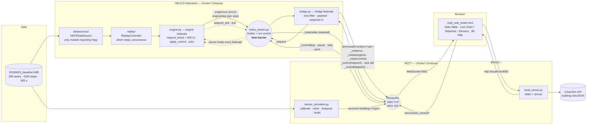

# Live Simulation Viewer

Replay a district building-energy simulation as a live co-simulation, and inspect it in
the browser — pause, step, set the pace, push a setpoint into the engine and watch the
line move, see buildings light up on a 3D map — with a synthetic sensor network running
alongside the ground truth.

The input is a single HDF5 file produced by the COESI/UrbanSim simulation engine
(`20260623_baseline.hdf5`: 289 time series over 41 entities, 4 320 steps at 600 s
resolution). A **HELICS engine federate** replays it step by step; a **bridge federate**
carries each step onto MQTT and carries the dashboard's commands back; a third process
derives noisy, imperfect *sensor readings* from the same file; one static HTML page
subscribes to it all and renders a heat-map table, a live chart, a sensor view and a
3D map.

The HDF5 replay is a stand-in. The engine/bridge split exists so that the real
HELICS-based simulation engine (CosimGym-style: every model a federate, HELICS time =
simulation time, running as fast as it computes) replaces exactly one federate —
`engine.py` — and nothing else changes. That is also why **play, pause, step and pace
are done by the HELICS broker with a time barrier**, not by the engine: they work on any
federation without touching a model.

This is a **research tool, not a monitoring product**: there is no database, no
server-side state, no build step and no test suite. The design priorities, in order, are
interactive inspection, provenance (every run publishes what produced it; every setpoint
is acknowledged with what was actually applied) and a swappable engine and data source.

---

## System architecture




Six containers, one entry point (`./run.sh up`):

| service | what it is | why it exists |
|---|---|---|
| `mosquitto` | Eclipse Mosquitto with two listeners | Browsers speak MQTT only over WebSockets (9001); Python clients use TCP (1883) |
| `helics-broker` | `helics_broker.py` | The HELICS broker **and the run control**: play/pause/step/pace over MQTT, done with a time barrier on the whole federation; health-checked; recycles after every federation |
| `engine` | `engine.py` | The engine federate: publishes each step at its simulation time, as fast as the broker lets it; applies setpoints and acknowledges them |
| `bridge` | `bridge.py` (same image) | The bridge federate: turns each HELICS step into ~175 MQTT topics plus retained `_meta/*`, turns `_control/setpoint/*` into HELICS messages |
| `sensors` | `sensor_simulator.py` (same image) | A believable sensor network derived from the same file, on its own cadence, no control channel |
| `frontend` | `local_server.py` | Serves the dashboard and strips CORS from the UrbanSim GeoJSON API |

Dependency direction in the Python is strict — `datasources/ → replay/ → engine.py`, and
`federation.py → {engine.py, bridge.py}`. `datasources/hdf5_source.py` is the only module
that imports `h5py` (a data-source swap touches one construction site); `replay/` imports
neither `paho.mqtt` nor `helics` (it only picks steps and writes provenance); `bridge.py`
imports neither `datasources/` nor `replay/` (everything it publishes arrived over HELICS).
That last line is the migration guarantee: **`federation.py` is the interface the real
engine has to speak, and `bridge.py`, the broker's run control, the sensors and the
dashboard do not change when it does.**

## How a step flows

```mermaid
sequenceDiagram
    autonumber
    participant K as Broker (run control)
    participant E as Engine (federate)
    participant P as Bridge (federate)
    participant B as Mosquitto
    participant D as Dashboard

    Note over K: barrier set before anyone joins: nothing runs ahead
    E->>P: HELICS engine/run {metadata, catalog, controls}
    P->>B: _meta/run · _meta/controls — retained
    K->>B: _meta/state {mode, pace} — retained

    loop every step — as fast as the barrier allows
        E->>K: request_time(t + 600 s)
        K-->>E: granted when the barrier has passed t + 600
        E->>P: HELICS engine/step {step, pass, values}
        P->>P: latching zero filter
        P->>B: ~175 × sim/coesi5/entity/var {step, total_steps, dataset, attributes, values}
        P->>B: _meta/progress {step, pass, sim_time} — retained
        B-->>D: table, chart, map repaint once; progress shows the simulated date
    end

    Note over D,K: pause · step · pace
    D->>B: _control/pause
    B-->>K: barrier frozen at the federates' current time
    D->>B: _control/step
    B-->>K: barrier moved by one period → exactly one more step
    D->>B: _control/pace {"sim_seconds_per_second": 3600}
    B-->>K: barrier advances 3600 sim-s per real second

    Note over D,E: setpoint
    D->>B: _control/setpoint/<entity>/Qt {"value": 0}
    B-->>P: setpoint listener → queue
    P->>E: HELICS {"command": "setpoint", …}  (delivered at the next grant)
    E->>E: validate · clamp · store override — next step publishes it
    E->>P: HELICS {"command": "setpoint_ack", applied, accepted, reason, step}
    P->>B: …/Qt/ack — retained
    B-->>D: panel shows "applied 0 at step n"
```


Two things in that diagram are deliberate. The engine has **no pacing code at all**: it
asks for the next step's time and publishes when granted, which is what a real model
federate does; pause and pace exist only as the broker's barrier. And there is **no seek**:
a federation's clock only runs forward, so the progress bar is read-only and **Step** (one
step at a time while paused) is the honest replacement for scrubbing. Browsing history
properly needs the run's stored results (InfluxDB) — see *Known limitations*.

The sensor simulator runs its own read loop independently — **it has no control
channel**, so it keeps reporting at each sensor type's own interval while the replay is
paused or sped up. That independence is the point: sensors in the real world do not care
what the analyst is doing.

---

## Quick start

Prerequisites: **Docker Desktop** (or Docker Engine with the Compose plugin). Nothing
else — Python only matters for host-side development.

```bash
git clone https://github.com/dshaterzadeh/Live_simulatation_viewer.git
cd Live_simulatation_viewer
cp .env.example .env       # once — every runtime setting lives here; run.sh refuses to start without it
./run.sh up
```

Then open **http://localhost:8002/mqtt_web_tester.html** and click **Connect**.

`run.sh up` builds the image once, starts both brokers, waits for their health checks,
and then starts the engine, bridge, sensor simulator and dashboard server. The stack keeps
running until `./run.sh down`.

`.env` is the single source of truth and **nothing has a fallback**: `docker-compose.yml`
injects it into every container, `run.sh` exports it for host-side runs, and every Python
entry point reads it through `config.py` — a CLI flag if given, else the variable named in
the flag's `--help`, else a `config: X is not set` error. A stale or half-copied `.env`
therefore stops with the variable's name rather than silently running against a made-up
port. The dashboard gets its broker host, port and topic from the same file via
`local_server.py`'s `/config.json`; nothing is hard-coded in the HTML.

```bash
./run.sh status            # container states + the URL
./run.sh logs              # follow the engine   (also: logs bridge|helics-broker|sensors|mosquitto|frontend)
./run.sh restart
./run.sh down
```

The settings you are most likely to touch, with the value `.env.example` ships. A
variable exported in the shell wins over `.env` for one run (`LOOP=0 ./run.sh up`), as it
does for Compose; `.env.example` documents every other one.

| variable | in `.env.example` | effect |
|---|---|---|
| `PACE` | `600` | Initial pace in **simulated seconds per real second** (600 = one 10-minute step per second). `0` = free-run. Changed live from the dashboard, so don't bake a fast value in |
| `PERIOD` | `600` | Simulated seconds per step — the file's dt. Broker, bridge and engine all read it |
| `LOOP` | `1` | `LOOP=0 ./run.sh up` replays once; the run then reads *finished* and the federation dissolves |
| `SEED` | blank (random) | `SEED=42 ./run.sh up` makes sensor noise, dropouts and faults reproducible |
| `SENSOR_DELAY` | `1.0` | Baseline pace of the sensor simulator, independent of `PACE` |
| `SIM_START` | blank (today, local midnight) | Calendar instant of simulation time 0 (ISO 8601). Progress and the Live Chart axis are dated from it |
| `MQTT_PORT` / `MQTT_WS_PORT` | `1883` / `9001` | Mosquitto's TCP and WebSocket listeners — declared once here; the compose file writes the listener config from them |
| `TOPIC` / `SENSORS_TOPIC` | `sim/coesi5` / `sensors` | Base topics for telemetry (+ `_meta/*`, `_control/*`) and for the sensor stream |
| `FRONTEND_PORT` | `8002` | Where `local_server.py` serves the page |

`SEED` and `SIM_START` are the only optional ones — blank means "not set", never a guess.
Keep comments in `.env` on their own lines: Docker's env-file parser treats a trailing
`# comment` as part of the value.

Looping is on by default for a reason: telemetry is QoS 0 and unretained, so an engine
that exits after one pass dissolves the federation and leaves the dashboard with nothing
arriving and no one listening for control commands — it looks broken when it has simply
finished. With `LOOP=0` the engine and bridge exit cleanly after the pass and stay down;
the HELICS broker recycles itself and waits for the next pair.

## Using the dashboard

**Run control** (top): ▶/❚❚ play–pause, ⏭ **step** (exactly one step, while paused), a
read-only progress bar with the **simulated date** and percentage, a **pace** selector
(real time · 1 min/s · 10 min/s · 1 h/s · 6 h/s · 1 day/s · free-run) and the **actual
rate** the engine is achieving. These publish to `sim/coesi5/_control/*` and are answered
by the HELICS broker, which holds the whole federation with a time barrier — so every
connected browser sees the same run, and a reloaded page shows the true state (it is
retained on `_meta/state`). Pace can only slow a run down; nothing makes the engine compute
faster, which is why the actual rate is shown next to the requested one. The `run:` badge
shows which file produced what you are looking at and the dated span it covers, with the
full provenance record on hover.

**Data Table** — rows are buildings, column groups are model entities, cells are
colour-coded by magnitude (red positive, blue negative). Columns appear as series become
active. *Last* / *Max* toggles between the latest value and the running maximum. A
drawer at the bottom shows the raw message log.

**Live Chart** — pick up to 8 buildings and a shared parameter; the series build as steps
arrive, with a crosshair tooltip and a full-timeline or last-400-steps range. The x-axis
is **simulated calendar time** (`start_time + step × dt` from `_meta/run`); storage stays
keyed by step. A new pass (or, with a real engine, a new RL episode) starts the chart
over instead of overwriting the previous one point by point.

The sidebar's **Setpoint → engine** panel is the two-way loop. Its buildings and inputs
come from the engine's retained **controls catalog** (`_meta/controls`: entity, variable,
units, min/max, and which variables move with it) — nothing is hard-coded in the page.
Pick a building and an input, type a value, **Apply**. The engine substitutes it for the
recorded value from the next step on and moves the coupled variable (`TBuilding` follows
`ZoneSetPoint`; `En_el` scales with `Qt`, so `0` parks the pump). The status line shows
only what the engine *acknowledged*: `applied 26 at step 153`, `clamped to [10, 30]`,
`rejected: …`, or `no override` after **Clear**. Acks are retained, so a reloaded page
shows the true state before any telemetry arrives. A setpoint sent while paused is applied
on the next step after play.

**Sensors** — the same chart and table machinery pointed at the `sensors/#` stream. The
x-axis is *real time* (each reading carries a timestamp), ticks land only on instants a
reading exists for, a **dropout draws a visible gap** in the line and an em dash in the
table, and a **fault** is plotted but ringed in amber. The sensor list, units and columns
come from the retained `sensors/_meta/sensors` message, so adding a sensor type in Python
needs no frontend change.

**3D Map** — enter a UrbanSim project id, **Load Map**, pick a parameter. Buildings are
extruded and coloured by their live value. The *Ground truth / Sensor reading* toggle
switches the colour source; in sensor mode a building with no current trustworthy reading
renders in a flat grey that is deliberately outside the value scale.

Broker host, port and base topic live behind the **Config** drop-down, pre-filled from
`/config.json` (i.e. from `.env`). Anything that changes while the run advances — step,
simulated time, progress, provenance — lives in the **Run** drawer, so the header keeps a
fixed geometry. The page is styled with coesi-frontend-main's `--coesi-*` design tokens
(copied verbatim into the first `<style>` section, with a small `--proto-*` section for
what this page needs and the frontend has no token for yet), and follows the same
`<html data-theme>` / `localStorage["coesi.theme"]` dark-mode convention, so it drops
into that frontend without a restyle.

## Driving the replay from a terminal

Anything that can publish MQTT can drive the run or push a setpoint:

```bash
mosquitto_pub -t sim/coesi5/_control/pause -m ''
mosquitto_pub -t sim/coesi5/_control/step  -m ''                                  # one step, while paused
mosquitto_pub -t sim/coesi5/_control/pace  -m '{"sim_seconds_per_second": 3600}'  # 1 simulated hour per second; 0 = free-run
mosquitto_pub -t sim/coesi5/_control/play  -m ''
mosquitto_sub -t sim/coesi5/_meta/state -C 1                                      # retained: {mode, pace, allowed_sim_time, period}
mosquitto_sub -t sim/coesi5/_meta/progress -C 1                                   # retained: {step, pass, sim_time, total_steps, finished}

E=heating_frassinetto_hp2_proc_0-0.heating_frassinetto_hp2_bui_0027_0
mosquitto_pub -t sim/coesi5/_control/setpoint/$E/Qt -m '{"value": 0}'          # park the heat pump
mosquitto_sub -t sim/coesi5/_control/setpoint/$E/Qt/ack -C 1 -F '%r %p'        # 1 = retained; shows what was applied
mosquitto_pub -t sim/coesi5/_control/setpoint/$E/Qt -n                         # clear the override
```

There is also a terminal subscriber with a live table and stats panel:

```bash
.venv/bin/python mqtt_tester.py -t 'sim/coesi5/#'
```

## Wire contract

Topics: `sim/coesi5/<entity>/<variable>`, for example
`sim/coesi5/heating_frassinetto_hp2_proc_0-0.heating_frassinetto_hp2_bui_0027_0/COP`.
Payload, one per topic per step:

```json
{"step": 2211, "total_steps": 4320,
 "dataset": "heating_frassinetto_hp2_proc_0-0.heating_frassinetto_hp2_bui_0027_0/COP",
 "attributes": {}, "values": 3.1336430317848407}
```

A sensor reading, for comparison:

```json
{"step": 224, "t": 134400.0, "timestamp": "2026-09-15T13:20:00+00:00",
 "sensor_type": "indoor_temp", "building": "bui_0001_0",
 "value": 21.8, "status": "ok", "unit": "C"}
```

Reserved sub-namespaces under the same base topic:

| topic | direction | notes |
|---|---|---|
| `_meta/run` | bridge → world | run provenance incl. `start_time`, `end_time`, `dt_seconds`; retained, QoS 1 |
| `_meta/state` | broker → world | `{mode: paced\|free\|paused, pace, allowed_sim_time, period, at}`; retained |
| `_meta/progress` | bridge → world | `{step, pass, sim_time, total_steps, finished, at}`; retained |
| `_meta/controls` | bridge → world | `[{entity, variable, units, min, max, couples}]`; retained |
| `_control/play`, `_control/pause`, `_control/step` | world → broker | empty payload |
| `_control/pace` | world → broker | `{"sim_seconds_per_second": 3600}`; `0` = free-run |
| `_control/setpoint/<entity>/<variable>` | world → engine (via bridge) | `{"value": 26}`; empty or `{"value": null}` clears |
| `_control/setpoint/<entity>/<variable>/ack` | engine → world | `{entity, variable, requested, applied, accepted, reason, step, at}`; retained, QoS 1 |

There is no `_control/seek` and no `_control/speed`. New behaviour goes on new reserved
topics — the telemetry payload shape is fixed, which is also why there is no `sim_time`
field in it: it is `start_time + step × dt_seconds`, both in `_meta/run`.

Between the two federates the contract is `federation.py`: one string publication
`engine/run` (metadata + attribute catalog + controls, once), one string publication
`engine/step` (`{"step", "pass", "values": {entity: {variable: value}}}`, per step), and
two endpoints (`engine/control` for setpoints in, `bridge/control` for acks and a farewell
`bye` out). **HELICS time is simulation time**: the engine requests `t + period` per step
and never sleeps. The broker's time barrier is the only thing that ever holds it back.

Sensor readings live on `sensors/<building>/<type>` and always carry
`status: "ok" | "dropout" | "fault"`. A dropout has `value: null` — never `0`, never a
missing key — which is what lets every renderer tell "no data" from "measured zero".
Sensor values are calibrated into a plausible per-type range before noise is applied
(the raw `TBuilding` is legitimately 7–19 °C when unheated; a thermostat would never
display that), so they track the simulation's shape (r ≈ 0.99) but are not directly
comparable to its absolute numbers. `--no-calibration` publishes raw values.

Full details — payload schema, QoS choices, the zero filter, calibration maths, every
frontend function — are in [ARCHITECTURE.md](ARCHITECTURE.md).

## Project layout

```
run.sh                      one entry point: up / down / restart / status / logs / dev
.env.example                every runtime setting, documented; copy to .env (gitignored) — .env is required
config.py                   require() / optional() / resolve(): how every script reads .env; no fallbacks
docker-compose.yml          mosquitto (listeners written from .env) + helics-broker (health-checked) → engine, bridge, sensors, frontend
Dockerfile                  one image for engine / bridge / helics-broker / sensors, deps pinned via requirements.txt
federation.py               the HELICS contract: publication + endpoint names, payload shapes, clock
engine.py                   engine federate — HDF5 replay at simulation time, apply_control (the seam the real physics replaces), acks
bridge.py                   bridge federate — HELICS → MQTT telemetry + retained _meta/*, MQTT setpoints → HELICS
helics_broker.py            HELICS broker + run control: play/pause/step/pace as a time barrier; recycles per federation
sensor_simulator.py         synthetic sensor stream — own CLI, own client, own pacing
datasources/base.py         SimulationDataSource — the swappable source contract
datasources/hdf5_source.py  HDF5DataSource — the only module that imports h5py
replay/controller.py        ReplayController — which steps in what order, passes, dated provenance (no pacing)
mqtt_web_tester.html        the entire frontend, no framework, no build step
mqtt_tester.py              terminal subscriber (Rich TUI)
local_server.py             static server + /config.json for the page + /proxy/ CORS stripper for the GeoJSON API
20260623_baseline.hdf5      the reference simulation output (10 MB)
ARCHITECTURE.md             the deep reference: every component, algorithm and contract (ch. 17: the production path)
broker-pacing-pattern.md    the broker-owns-pacing pattern as a standalone note, independent of this code
CLAUDE.md                   working conventions and invariants for the codebase
```

There is no `mosquitto.conf`: the compose file writes the listener config from `.env` at
start-up, so `MQTT_PORT` / `MQTT_WS_PORT` are declared once.

## Development

Mosquitto never changes while iterating, the federation does. `dev` keeps Mosquitto,
the sensors and the dashboard server in Docker and runs the HELICS broker, bridge and
engine from a local venv in the foreground, all stopped by one Ctrl+C:

```bash
python3 -m venv .venv && .venv/bin/pip install -r requirements.txt   # once
./run.sh dev
```

(The HELICS broker runs on the host in dev mode rather than in Docker: a ZMQ core needs
the broker to connect *back* to each federate, which a broker inside Docker Desktop's VM
cannot reliably do to processes on the Mac. The three processes take no arguments —
`run.sh` has exported `.env`, whose host-side addresses are `127.0.0.1`. To run them by
hand instead: `set -a; . .env; set +a`, then `.venv/bin/python helics_broker.py`,
`bridge.py`, `engine.py`; a CLI flag such as `--pace 0` overrides `.env` for that process.)

The dashboard is bind-mounted into its container, so editing `mqtt_web_tester.html` only
needs a browser reload — unless the editor *replaced* the file (new inode: `sed -i`,
most "atomic save" editors), which a single-file bind mount on Docker Desktop does not
follow; then `docker compose up -d --force-recreate frontend`.

Other useful commands:

```bash
.venv/bin/python engine.py -f 20260623_baseline.hdf5 --explore                  # list datasets
.venv/bin/python sensor_simulator.py --list-types                             # types, ranges, cadences
.venv/bin/python sensor_simulator.py -f 20260623_baseline.hdf5 --sim-start 2026-01-12T00:00:00
```

There is no test suite; changes are verified against the running system. The checks
worth repeating are listed under *Verifying a change* in [CLAUDE.md](CLAUDE.md) —
bridge parity (the engine+bridge pair publishes byte-for-byte what the old single
publisher did), control behaviour, the setpoint round-trip, late-subscriber correctness,
retained metadata, sensor realism and the chart's ordering/decimation invariants.

## Known limitations and next steps

- **Local-machine trust model.** The broker allows anonymous connections and
  `_control/*` is a write path; the `/proxy/` endpoint fetches any URL. The proxy is
  loopback-only, but do not run this stack on an untrusted network.
- **No seek, and no history yet.** A federation's clock cannot run backwards, so the
  progress bar is read-only and *Step* is the precise tool instead. Browsing earlier
  moments properly means reading the run's stored results — the real engine writes
  every step to InfluxDB — through a "History" mode on the chart and table. That needs
  the store to exist in this stack first; it is the next item.
- **One step blob over HELICS, not one publication per variable.** The real engine
  publishes each variable separately (`building_federate.0/T_indoor`, typed, with units);
  the bridge will register those subscriptions from the scenario YAML. Its publishing
  code does not change — only where `values` come from.
- **The federation is static and heals in ~10 s.** Exactly two federates, no late joining.
  If the engine or bridge dies, the broker notices, tears the federation down and Docker
  restarts both. A restarted engine starts with no overrides while the last retained acks
  still say "applied" — re-apply from the dashboard.
- **`apply_control` is a legible stand-in**, not physics: it substitutes the commanded
  value and moves one coupled variable predictably. It exists so a dashboard action
  changes a chart line within one step.
- **Pace only slows.** The barrier can hold a federation back; it cannot make a slow model
  step faster. The dashboard shows the actual rate next to the requested one for that
  reason.
- **No retained telemetry snapshot.** A browser connecting mid-run fills in progressively
  rather than instantly.
- **Chart and table are hand-rolled SVG/DOM.** They are correct and parameterised for both
  tabs, but the table repaints every cell each frame and the chart carries a decimation
  cache it does not need. Dirty-cell painting and dropping the cache are straightforward;
  replacing the SVG with a canvas library such as uPlot (null-as-gap, time and numeric
  axes built in) is the larger option if the chart keeps growing.
- **Whole-file eager load.** Fine at 10 MB; a multi-GB run would need chunked reads.
- **The UrbanSim API is internal** to Politecnico di Torino; the 3D map needs network
  access to it. Everything else works without it.

## Author

David Shaterzadeh — COESI / Politecnico di Torino.
