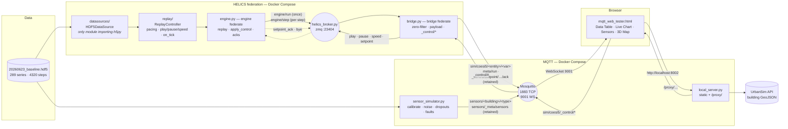

# Live Simulation Viewer

Replay a district building-energy simulation as if it were a live co-simulation, and
inspect it in the browser — pause, change speed, push a setpoint into the engine and
watch the line move, see buildings light up on a 3D map — with a synthetic sensor network
running alongside the ground truth.

The input is a single HDF5 file produced by the COESI/UrbanSim simulation engine
(`20260623_baseline.hdf5`: 289 time series over 41 entities, 4 320 steps at 600 s
resolution). A **HELICS engine federate** replays it step by step; a **bridge federate**
carries each step onto MQTT and carries the dashboard's commands back; a third process
derives noisy, imperfect *sensor readings* from the same file; one static HTML page
subscribes to it all and renders a heat-map table, a live chart, a sensor view and a
3D map.

The HDF5 replay is a stand-in. The engine/bridge split exists so that the real
HELICS-based simulation engine, when it arrives, replaces exactly one federate —
`engine.py` — and nothing else changes.

This is a **research tool, not a monitoring product**: there is no database, no
server-side state, no build step and no test suite. The design priorities, in order, are
interactive inspection, provenance (every run publishes what produced it; every setpoint
is acknowledged with what was actually applied) and a swappable engine and data source.

---

## System architecture



Six containers, one entry point (`./run.sh up`):

| service | what it is | why it exists |
|---|---|---|
| `mosquitto` | Eclipse Mosquitto with two listeners | Browsers speak MQTT only over WebSockets (9001); Python clients use TCP (1883) |
| `helics-broker` | `helics_broker.py` | The HELICS broker the two federates meet at; health-checked; recycles after every federation |
| `engine` | `engine.py` | The engine federate: replays the file through `ReplayController`, applies setpoints, acknowledges them |
| `bridge` | `bridge.py` (same image) | The bridge federate: turns each HELICS step into ~175 MQTT topics, turns `_control/*` back into HELICS messages |
| `sensors` | `sensor_simulator.py` (same image) | A believable sensor network derived from the same file, on its own cadence, no control channel |
| `frontend` | `local_server.py` | Serves the dashboard and strips CORS from the UrbanSim GeoJSON API |

Dependency direction in the Python is strict — `datasources/ → replay/ → engine.py`, and
`federation.py → {engine.py, bridge.py}`. `datasources/hdf5_source.py` is the only module
that imports `h5py` (a data-source swap touches one construction site); `replay/` imports
neither `paho.mqtt` nor `helics` (it is pure pacing); `bridge.py` imports neither
`datasources/` nor `replay/` (everything it publishes arrived over HELICS). That last
line is the migration guarantee: **`federation.py` is the interface the real engine has to
speak, and `bridge.py`, the sensors and the dashboard do not change when it does.**

## How a step flows

```mermaid
sequenceDiagram
    autonumber
    participant E as Engine (federate)
    participant P as Bridge (federate)
    participant B as Mosquitto
    participant D as Dashboard

    Note over E,P: on start — HELICS engine/run, once
    E->>P: {metadata, catalog}
    P->>B: sim/coesi5/_meta/run — retained, QoS 1
    B-->>D: delivered immediately to any late subscriber

    loop every 50 ms tick, playing or paused
        E->>E: request_time(t + Δ); drain control endpoint
        P->>P: request_time(t + Δ); read new step if any; send queued commands
    end

    loop every step (delay ÷ speed)
        E->>E: ReplayController yields (step, values); apply_overrides
        E->>P: HELICS engine/step {step, values}
        P->>P: latching zero filter — suppress a series only until its first non-zero
        P->>B: ~175 × PUBLISH sim/coesi5/entity/var {step, total_steps, dataset, attributes, values}
        B-->>D: ~175 JSON messages
        D->>D: update dataStore · maxima · chart history (sorted by step)
        D->>D: one paint per animation frame → table, chart, map, transport bar
    end

    Note over D,E: user applies a setpoint (Live Chart sidebar) or presses pause
    D->>B: sim/coesi5/_control/setpoint/<entity>/Qt {"value": 0}
    B-->>P: _control/# subscription → queue
    P->>E: HELICS {"command": "setpoint", entity, variable, value}
    E->>E: validate · clamp · store override — next step publishes it
    E->>P: HELICS {"command": "setpoint_ack", applied, accepted, reason, step}
    P->>B: …/Qt/ack — retained, QoS 1
    B-->>D: panel shows "applied 0 at step n" (and so does a page opened later)
```

Two things in that diagram are deliberate. HELICS time keeps ticking while the replay is
paused — otherwise a `play` could never reach a paused engine, because the bridge would be
blocked waiting for the engine to advance. And there is **no seek**: a federation's clock
only runs forward, so the scrubber is a read-only progress bar. That is a regression
against "pause, scrub and re-watch" taken knowingly for this pass.

The sensor simulator runs its own read loop independently — **it has no control
channel**, so it keeps reporting at each sensor type's own interval while the replay is
paused or sped up. That independence is the point: sensors in the real world do not care
what the analyst is doing.

---

## Quick start

Prerequisites: **Docker Desktop** (or Docker Engine with the Compose plugin). Nothing
else — Python only matters for host-side development.

```bash
git clone https://github.com/dshaterzadeh/Live_simulatation_viewer.git
cd Live_simulatation_viewer
./run.sh up
```

Then open **http://localhost:8002/mqtt_web_tester.html** and click **Connect**.

`run.sh up` builds the image once, starts both brokers, waits for their health checks,
and then starts the engine, bridge, sensor simulator and dashboard server. The stack keeps
running until `./run.sh down`.

```bash
./run.sh status            # container states + the URL
./run.sh logs              # follow the engine   (also: logs bridge|helics-broker|sensors|mosquitto|frontend)
./run.sh restart
./run.sh down
```

Knobs, all optional, all environment variables:

| knob | default | effect |
|---|---|---|
| `DELAY` | `1.0` | Baseline seconds per replayed step. The dashboard's speed selector *divides* this at runtime, so leave it watchable |
| `LOOP` | `1` | `LOOP=0 ./run.sh up` replays once and stops instead of wrapping to step 0 forever |
| `SEED` | random | `SEED=42 ./run.sh up` makes sensor noise, dropouts and faults reproducible |
| `SENSOR_DELAY` | `1.0` | Baseline pace of the sensor simulator, independent of `DELAY` |

Looping is on by default for a reason: telemetry is QoS 0 and unretained, so an engine
that exits after one pass dissolves the federation and leaves the dashboard with nothing
arriving and no one listening for control commands — it looks broken when it has simply
finished. With `LOOP=0` the engine and bridge exit cleanly after the pass and stay down;
the HELICS broker recycles itself and waits for the next pair.

## Using the dashboard

**Transport bar** (top): play/pause, a read-only progress bar over all 4 320 steps, and a
speed selector. Play/pause/speed publish to `sim/coesi5/_control/*` and drive the
*engine* through the bridge, so every connected browser sees the same replay. The `run:`
badge shows which file produced what you are looking at, with the full provenance record
on hover.

**Data Table** — rows are buildings, column groups are model entities, cells are
colour-coded by magnitude (red positive, blue negative). Columns appear as series become
active. *Last* / *Max* toggles between the latest value and the running maximum. A
drawer at the bottom shows the raw message log.

**Live Chart** — pick up to 8 buildings and a shared parameter; the series build as steps
arrive, with a crosshair tooltip and a full-timeline or last-400-steps range. The x-axis
is simulation *steps*. A loop wrap redraws in place — points are stored sorted by step,
never appended.

The sidebar's **Setpoint → engine** panel is the two-way loop: pick a building and a
target — *Zone setpoint (°C)* or *Heat-pump heat output (W)* — type a value, **Apply**.
The engine substitutes it for the recorded value from the next step on and moves a
coupled variable with it (`TBuilding` follows the zone setpoint; `En_el` scales with heat
output, so `0` parks the pump). The status line shows only what the engine *acknowledged*:
`applied 26 at step 153`, `clamped to [10, 30]`, `rejected: unknown entity/variable`, or
`no override` after **Clear**. Acks are retained, so a reloaded page shows the true state
before any telemetry arrives. Try `bui_0027_0` + heat output `0` while charting `Qt` or
`En_el`.

**Sensors** — the same chart and table machinery pointed at the `sensors/#` stream. The
x-axis is *real time* (each reading carries a timestamp), ticks land only on instants a
reading exists for, a **dropout draws a visible gap** in the line and an em dash in the
table, and a **fault** is plotted but ringed in amber. The sensor list, units and columns
come from the retained `sensors/_meta/sensors` message, so adding a sensor type in Python
needs no frontend change.

**3D Map** — enter a UrbanSim project id, **Load Map**, pick a parameter. Buildings are
extruded and coloured by their live value. The *Ground truth / Sensor reading* toggle
switches the colour source; in sensor mode a building with no current trustworthy reading
renders in a flat grey that is deliberately outside the value scale.

Broker host, port and base topic live behind the **Config** drop-down.

## Driving the replay from a terminal

Anything that can publish MQTT can drive the transport or push a setpoint:

```bash
mosquitto_pub -t sim/coesi5/_control/pause -m ''
mosquitto_pub -t sim/coesi5/_control/speed -m '{"multiplier": 4.0}'
mosquitto_pub -t sim/coesi5/_control/play  -m ''

E=heating_frassinetto_hp2_proc_0-0.heating_frassinetto_hp2_bui_0027_0
mosquitto_pub -t sim/coesi5/_control/setpoint/$E/Qt -m '{"value": 0}'          # park the heat pump
mosquitto_sub -t sim/coesi5/_control/setpoint/$E/Qt/ack -C 1 -F '%r %p'        # 1 = retained; shows what was applied
mosquitto_pub -t sim/coesi5/_control/setpoint/$E/Qt -n                         # clear the override
```

There is also a terminal subscriber with a live table and stats panel:

```bash
.venv/bin/python mqtt_tester.py -t 'sim/coesi5/#'
```

## Wire contract

Topics: `sim/coesi5/<entity>/<variable>`, for example
`sim/coesi5/heating_frassinetto_hp2_proc_0-0.heating_frassinetto_hp2_bui_0027_0/COP`.
Payload, one per topic per step:

```json
{"step": 2211, "total_steps": 4320,
 "dataset": "heating_frassinetto_hp2_proc_0-0.heating_frassinetto_hp2_bui_0027_0/COP",
 "attributes": {}, "values": 3.1336430317848407}
```

A sensor reading, for comparison:

```json
{"step": 224, "t": 134400.0, "timestamp": "2026-09-15T13:20:00+00:00",
 "sensor_type": "indoor_temp", "building": "bui_0001_0",
 "value": 21.8, "status": "ok", "unit": "C"}
```

Reserved sub-namespaces under the same base topic:

| topic | direction | notes |
|---|---|---|
| `_meta/run` | bridge → world | run provenance; retained, QoS 1 |
| `_control/play`, `_control/pause` | world → engine | empty payload |
| `_control/speed` | world → engine | `{"multiplier": 4.0}` |
| `_control/setpoint/<entity>/<variable>` | world → engine | `{"value": 26}`; empty or `{"value": null}` clears |
| `_control/setpoint/<entity>/<variable>/ack` | engine → world | `{entity, variable, requested, applied, accepted, reason, step, at}`; retained, QoS 1 |

There is no `_control/seek`. New behaviour goes on new reserved topics — the telemetry
payload shape is fixed, which is also why there is no `sim_time` field: it is
`step × dt_seconds`, and `dt_seconds` is in `_meta/run`.

Between the two federates the contract is `federation.py`: one string publication
`engine/run` (metadata + attribute catalog, once), one string publication `engine/step`
(`{"step", "values": {entity: {variable: value}}}`, per step), and two endpoints
(`engine/control` for commands in, `bridge/control` for acks and a farewell `bye` out).
HELICS time is the engine's wall clock, advanced in 50 ms slices whether playing or
paused; simulation time is derived from the step.

Sensor readings live on `sensors/<building>/<type>` and always carry
`status: "ok" | "dropout" | "fault"`. A dropout has `value: null` — never `0`, never a
missing key — which is what lets every renderer tell "no data" from "measured zero".
Sensor values are calibrated into a plausible per-type range before noise is applied
(the raw `TBuilding` is legitimately 7–19 °C when unheated; a thermostat would never
display that), so they track the simulation's shape (r ≈ 0.99) but are not directly
comparable to its absolute numbers. `--no-calibration` publishes raw values.

Full details — payload schema, QoS choices, the zero filter, calibration maths, every
frontend function — are in [ARCHITECTURE.md](ARCHITECTURE.md).

## Project layout

```
run.sh                      one entry point: up / down / restart / status / logs / dev
docker-compose.yml          mosquitto + helics-broker (health-checked) → engine, bridge, sensors, frontend
Dockerfile                  one image for engine / bridge / helics-broker / sensors, deps pinned via requirements.txt
federation.py               the HELICS contract: publication + endpoint names, payload shapes, clock
engine.py                   engine federate — HDF5 replay, apply_control (the seam the real physics replaces), acks
bridge.py                   bridge federate — HELICS → MQTT telemetry (zero filter, payload), MQTT _control/* → HELICS
helics_broker.py            HELICS broker with a readiness sentinel; recycles per federation
sensor_simulator.py         synthetic sensor stream — own CLI, own client, own pacing
datasources/base.py         SimulationDataSource — the swappable source contract
datasources/hdf5_source.py  HDF5DataSource — the only module that imports h5py
replay/controller.py        ReplayController — pacing, play/pause/speed, on_tick hook, provenance
mqtt_web_tester.html        the entire frontend, no framework, no build step
mqtt_tester.py              terminal subscriber (Rich TUI)
local_server.py             static server + /proxy/ CORS stripper for the GeoJSON API
mosquitto.conf              two listeners: 1883 TCP, 9001 WebSockets
20260623_baseline.hdf5      the reference simulation output (10 MB)
ARCHITECTURE.md             the deep reference: every component, algorithm and contract
CLAUDE.md                   working conventions and invariants for the codebase
```

## Development

Mosquitto never changes while iterating, the federation does. `dev` keeps Mosquitto,
the sensors and the dashboard server in Docker and runs the HELICS broker, bridge and
engine from a local venv in the foreground, at a faster pace, all stopped by one Ctrl+C:

```bash
python3 -m venv .venv && .venv/bin/pip install -r requirements.txt   # once
./run.sh dev
```

(The HELICS broker runs on the host in dev mode rather than in Docker: a ZMQ core needs
the broker to connect *back* to each federate, which a broker inside Docker Desktop's VM
cannot reliably do to processes on the Mac.)

The dashboard is bind-mounted into its container, so editing `mqtt_web_tester.html` only
needs a browser reload.

Other useful commands:

```bash
.venv/bin/python engine.py -f 20260623_baseline.hdf5 --explore                  # list datasets
.venv/bin/python sensor_simulator.py --list-types                             # types, ranges, cadences
.venv/bin/python sensor_simulator.py -f 20260623_baseline.hdf5 --sim-start 2026-01-12T00:00:00
```

There is no test suite; changes are verified against the running system. The checks
worth repeating are listed under *Verifying a change* in [CLAUDE.md](CLAUDE.md) —
bridge parity (the engine+bridge pair publishes byte-for-byte what the old single
publisher did), control behaviour, the setpoint round-trip, late-subscriber correctness,
retained metadata, sensor realism and the chart's ordering/decimation invariants.

## Known limitations and next steps

- **Local-machine trust model.** The broker allows anonymous connections and
  `_control/*` is a write path; the `/proxy/` endpoint fetches any URL. The proxy is
  loopback-only, but do not run this stack on an untrusted network.
- **No seek.** Removed with the HELICS split — a federation's clock cannot run backwards.
  The scrubber is read-only. Bringing scrubbing back means a checkpoint/restore design
  done together with the real engine, not bolted onto the stand-in.
- **Transport state is optimistic.** Setpoints are acknowledged, play/pause/speed are
  not: a page opened while the replay is paused assumes it is playing until the next
  message disagrees. A retained `_meta/state` on every transition would make it
  authoritative.
- **The federation is static and heals in ~30 s.** Exactly two federates, no late joining.
  If the engine or bridge crashes, the other exits after HELICS's lost-comms timeout and
  Docker restarts both. A restarted engine starts with no overrides while the last
  retained acks still say "applied" — re-apply from the dashboard, or see the
  re-announce-on-start item in ARCHITECTURE §16.
- **HELICS time is the engine's wall clock**, not simulation time — that is what lets a
  paused engine still receive `play`. The real engine will make it the simulation clock.
- **`apply_control` is a legible stand-in**, not physics: it substitutes the commanded
  value and moves one coupled variable predictably. It exists so a dashboard action
  changes a chart line within one step.
- **No retained telemetry snapshot.** A browser connecting mid-run fills in progressively
  rather than instantly.
- **Chart and table are hand-rolled SVG/DOM.** They are correct and parameterised for both
  tabs, but the table repaints every cell each frame and the chart carries a decimation
  cache it does not need. Dirty-cell painting and dropping the cache are straightforward;
  replacing the SVG with a canvas library such as uPlot (null-as-gap, time and numeric
  axes built in) is the larger option if the chart keeps growing.
- **Whole-file eager load.** Fine at 10 MB; a multi-GB run would need chunked reads.
- **The UrbanSim API is internal** to Politecnico di Torino; the 3D map needs network
  access to it. Everything else works without it.

## Author

David Shaterzadeh — COESI / Politecnico di Torino.
