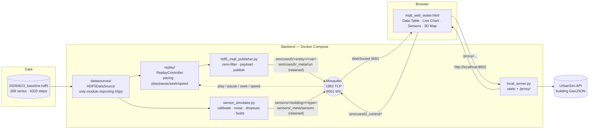
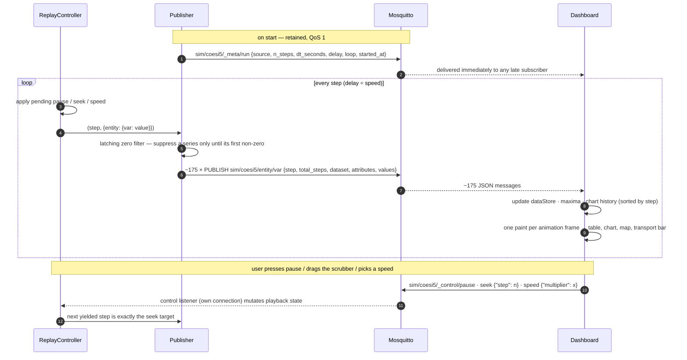

# Live Simulation Viewer

Replay a district building-energy simulation as if it were a live IoT stream, and inspect
it in the browser — pause, scrub, change speed, watch buildings light up on a 3D map — with
a synthetic sensor network running alongside the ground truth.

The input is a single HDF5 file produced by the COESI/UrbanSim simulation engine
(`20260623_baseline.hdf5`: 289 time series over 41 entities, 4 320 steps at 600 s
resolution). A Python publisher replays it step by step over MQTT; a second process
derives noisy, imperfect *sensor readings* from the same file; one static HTML page
subscribes to both and renders a heat-map table, a live chart, a sensor view and a
3D map.

This is a **research tool, not a monitoring product**: there is no database, no
server-side state, no build step and no test suite. The design priorities, in order, are
interactive inspection, provenance (every run publishes what produced it) and a swappable
data source.

---

## System architecture



Four containers, one entry point (`./run.sh up`):

| service | what it is | why it exists |
|---|---|---|
| `mosquitto` | Eclipse Mosquitto with two listeners | Browsers speak MQTT only over WebSockets (9001); Python clients use TCP (1883) |
| `publisher` | `hdf5_mqtt_publisher.py` | The replay. Publishes ~175 topics per step, listens for transport commands |
| `sensors` | `sensor_simulator.py` (same image) | A believable sensor network derived from the same file, on its own cadence |
| `frontend` | `local_server.py` | Serves the dashboard and strips CORS from the UrbanSim GeoJSON API |

Dependency direction in the Python is strict — `datasources/ → replay/ → publisher` — and
`datasources/hdf5_source.py` is the only module that imports `h5py`, which is what makes
the source layer replaceable (an InfluxDB source would implement the same
`SimulationDataSource` interface and nothing downstream would change).

## How a step flows



The sensor simulator runs the same read loop independently — **it has no control
channel**, so it keeps reporting at each sensor type's own interval while the replay is
paused, scrubbed or sped up. That independence is the point: sensors in the real world do
not care what the analyst is doing.

---

## Quick start

Prerequisites: **Docker Desktop** (or Docker Engine with the Compose plugin). Nothing
else — Python only matters for host-side development.

```bash
git clone https://github.com/dshaterzadeh/Live_simulatation_viewer.git
cd Live_simulatation_viewer
./run.sh up
```

Then open **http://localhost:8002/mqtt_web_tester.html** and click **Connect**.

`run.sh up` builds the image once, starts the broker, waits for its health check, and
then starts the publisher, sensor simulator and dashboard server. All four restart with
Docker and keep running until `./run.sh down`.

```bash
./run.sh status            # container states + the URL
./run.sh logs              # follow the publisher   (also: logs sensors|mosquitto|frontend)
./run.sh restart
./run.sh down
```

Knobs, all optional, all environment variables:

| knob | default | effect |
|---|---|---|
| `DELAY` | `1.0` | Baseline seconds per replayed step. The dashboard's speed selector *divides* this at runtime, so leave it watchable |
| `LOOP` | `1` | `LOOP=0 ./run.sh up` replays once and stops instead of wrapping to step 0 forever |
| `SEED` | random | `SEED=42 ./run.sh up` makes sensor noise, dropouts and faults reproducible |
| `SENSOR_DELAY` | `1.0` | Baseline pace of the sensor simulator, independent of `DELAY` |

Looping is on by default for a reason: telemetry is QoS 0 and unretained, so a publisher
that exits after one pass leaves the dashboard with nothing arriving and no one listening
for control commands — it looks broken when it has simply finished.

## Using the dashboard

**Transport bar** (top): play/pause, a scrubber over all 4 320 steps, and a speed
selector. These publish to `sim/coesi5/_control/*` and drive the *publisher*, so every
connected browser sees the same replay. The `run:` badge shows which file produced what
you are looking at, with the full provenance record on hover.

**Data Table** — rows are buildings, column groups are model entities, cells are
colour-coded by magnitude (red positive, blue negative). Columns appear as series become
active. *Last* / *Max* toggles between the latest value and the running maximum. A
drawer at the bottom shows the raw message log.

**Live Chart** — pick up to 8 buildings and a shared parameter; the series build as steps
arrive, with a crosshair tooltip and a full-timeline or last-400-steps range. The x-axis
is simulation *steps*. Seeking backwards redraws in place — points are stored sorted by
step, never appended.

**Sensors** — the same chart and table machinery pointed at the `sensors/#` stream. The
x-axis is *real time* (each reading carries a timestamp), ticks land only on instants a
reading exists for, a **dropout draws a visible gap** in the line and an em dash in the
table, and a **fault** is plotted but ringed in amber. The sensor list, units and columns
come from the retained `sensors/_meta/sensors` message, so adding a sensor type in Python
needs no frontend change.

**3D Map** — enter a UrbanSim project id, **Load Map**, pick a parameter. Buildings are
extruded and coloured by their live value. The *Ground truth / Sensor reading* toggle
switches the colour source; in sensor mode a building with no current trustworthy reading
renders in a flat grey that is deliberately outside the value scale.

Broker host, port and base topic live behind the **Config** drop-down.

## Driving the replay from a terminal

Anything that can publish MQTT can drive the transport:

```bash
mosquitto_pub -t sim/coesi5/_control/pause -m ''
mosquitto_pub -t sim/coesi5/_control/seek  -m '{"step": 2000}'
mosquitto_pub -t sim/coesi5/_control/speed -m '{"multiplier": 4.0}'
mosquitto_pub -t sim/coesi5/_control/play  -m ''
```

There is also a terminal subscriber with a live table and stats panel:

```bash
.venv/bin/python mqtt_tester.py -t 'sim/coesi5/#'
```

## Wire contract

Topics: `sim/coesi5/<entity>/<variable>`, for example
`sim/coesi5/heating_frassinetto_hp2_proc_0-0.heating_frassinetto_hp2_bui_0027_0/COP`.
Payload, one per topic per step:

```json
{"step": 2211, "total_steps": 4320,
 "dataset": "heating_frassinetto_hp2_proc_0-0.heating_frassinetto_hp2_bui_0027_0/COP",
 "attributes": {}, "values": 3.1336430317848407}
```

A sensor reading, for comparison:

```json
{"step": 224, "t": 134400.0, "timestamp": "2026-09-15T13:20:00+00:00",
 "sensor_type": "indoor_temp", "building": "bui_0001_0",
 "value": 21.8, "status": "ok", "unit": "C"}
```

Reserved sub-namespaces: `_meta/run` (retained provenance, QoS 1) and `_control/*`
(play, pause, seek, speed). New behaviour goes on new reserved topics — the telemetry
payload shape is fixed.

Sensor readings live on `sensors/<building>/<type>` and always carry
`status: "ok" | "dropout" | "fault"`. A dropout has `value: null` — never `0`, never a
missing key — which is what lets every renderer tell "no data" from "measured zero".
Sensor values are calibrated into a plausible per-type range before noise is applied
(the raw `TBuilding` is legitimately 7–19 °C when unheated; a thermostat would never
display that), so they track the simulation's shape (r ≈ 0.99) but are not directly
comparable to its absolute numbers. `--no-calibration` publishes raw values.

Full details — payload schema, QoS choices, the zero filter, calibration maths, every
frontend function — are in [ARCHITECTURE.md](ARCHITECTURE.md).

## Project layout

```
run.sh                      one entry point: up / down / restart / status / logs / dev
docker-compose.yml          broker (health-checked) → publisher, sensors, frontend
Dockerfile                  publisher + sensor image, deps pinned via requirements.txt
hdf5_mqtt_publisher.py      MQTT lifecycle, latching zero filter, payload build, CLI
sensor_simulator.py         synthetic sensor stream — own CLI, own client, own pacing
datasources/base.py         SimulationDataSource — the swappable source contract
datasources/hdf5_source.py  HDF5DataSource — the only module that imports h5py
replay/controller.py        ReplayController — pacing, play/pause/seek/speed, provenance
mqtt_web_tester.html        the entire frontend, no framework, no build step
mqtt_tester.py              terminal subscriber (Rich TUI)
local_server.py             static server + /proxy/ CORS stripper for the GeoJSON API
mosquitto.conf              two listeners: 1883 TCP, 9001 WebSockets
20260623_baseline.hdf5      the reference simulation output (10 MB)
ARCHITECTURE.md             the deep reference: every component, algorithm and contract
CLAUDE.md                   working conventions and invariants for the codebase
```

## Development

The broker never changes while iterating, the Python does. `dev` keeps the broker and
dashboard server in Docker and runs the two Python processes from a local venv in the
foreground, at a faster pace, both stopped by one Ctrl+C:

```bash
python3 -m venv .venv && .venv/bin/pip install -r requirements.txt   # once
./run.sh dev
```

The dashboard is bind-mounted into its container, so editing `mqtt_web_tester.html` only
needs a browser reload.

Other useful commands:

```bash
.venv/bin/python hdf5_mqtt_publisher.py -f 20260623_baseline.hdf5 --explore   # list datasets
.venv/bin/python sensor_simulator.py --list-types                             # types, ranges, cadences
.venv/bin/python sensor_simulator.py -f 20260623_baseline.hdf5 --sim-start 2026-01-12T00:00:00
```

There is no test suite; changes are verified against the running system. The checks
worth repeating are listed under *Verifying a change* in [CLAUDE.md](CLAUDE.md) —
publisher parity, control behaviour, retained metadata, sensor realism and the chart's
ordering/decimation invariants.

## Known limitations and next steps

- **Local-machine trust model.** The broker allows anonymous connections and
  `_control/*` is a write path; the `/proxy/` endpoint fetches any URL. The proxy is
  loopback-only, but do not run this stack on an untrusted network.
- **Transport state is optimistic.** The publisher never echoes play/pause/speed back, so
  a page opened while the replay is paused assumes it is playing until the next message
  disagrees. A retained `_meta/state` on every transition would make it authoritative.
- **No retained telemetry snapshot.** A browser connecting mid-run fills in progressively
  rather than instantly.
- **Chart and table are hand-rolled SVG/DOM.** They are correct and parameterised for both
  tabs, but the table repaints every cell each frame and the chart carries a decimation
  cache it does not need. Dirty-cell painting and dropping the cache are straightforward;
  replacing the SVG with a canvas library such as uPlot (null-as-gap, time and numeric
  axes built in) is the larger option if the chart keeps growing.
- **Whole-file eager load.** Fine at 10 MB; a multi-GB run would need chunked reads.
- **The UrbanSim API is internal** to Politecnico di Torino; the 3D map needs network
  access to it. Everything else works without it.

## Author

David Shaterzadeh — COESI / Politecnico di Torino.
